Analysis of the 2020 Presidential Election
================
Alexander Sanchez
2024-10-20

[corr_simple()](https://towardsdatascience.com/how-to-create-a-correlation-matrix-with-too-many-variables-309cc0c0a57)

# Instructions and Expectations

Predicting voter behavior is complicated for many reasons despite the
tremendous effort in collecting, cleaning, analyzing, and understanding
many available datasets. As the midterm elections in the United States
is currently being held near the midpoint of the current president’s
four-year term of office, it is a good time for us to review the 2020
United States presidential election data! Despite that the 2016
presidential election came as a big surprise to many, Biden’s victory in
the 2020 presidential election has been widely predicted (e.g., see the
well-known Nate Silver in FiveThirtyEight).

# Data

We will start the analysis with two data sets. The first one is the
election data, which is drawn from here. The data contains county-level
election results.

The second dataset is the 2017 United States county-level census data,
which is available here.

The following code load in these two data sets: `election.raw` and
`census.`

# Exploratory Data Analysis

## Election Data

**1. (1 pts) Compute the total number of distinct values in state in
election.raw to verify that the data contains all states and a federal
district**

The following is the first few rows of the `election.raw` data.

    ## # A tibble: 6 × 5
    ##   state    county     candidate     party total_votes
    ##   <chr>    <chr>      <fct>         <fct>       <dbl>
    ## 1 Delaware Kent       Joe Biden     DEM         44552
    ## 2 Delaware Kent       Donald Trump  REP         41009
    ## 3 Delaware Kent       Jo Jorgensen  LIB          1044
    ## 4 Delaware Kent       Howie Hawkins GRN           420
    ## 5 Delaware New Castle Joe Biden     DEM        195034
    ## 6 Delaware New Castle Donald Trump  REP         88364

Checking dimensions of `election.raw` data set.

    ## [1] 32177     5

Checking for missing values in `election.raw` data set.

    ## [1] "There are no missing values"

Checking unique vlaues for each column

    ##       state      county   candidate       party total_votes 
    ##          51        2825          38          26        6762

## Census data

The following is the first few rows of the `census` data. The column
names are all very self-explanatory:

    ## # A tibble: 6 × 37
    ##   CountyId State  County TotalPop   Men  Women Hispanic White Black Native Asian
    ##      <dbl> <chr>  <chr>     <dbl> <dbl>  <dbl>    <dbl> <dbl> <dbl>  <dbl> <dbl>
    ## 1     1001 Alaba… Autau…    55036 26899  28137      2.7  75.4  18.9    0.3   0.9
    ## 2     1003 Alaba… Baldw…   203360 99527 103833      4.4  83.1   9.5    0.8   0.7
    ## 3     1005 Alaba… Barbo…    26201 13976  12225      4.2  45.7  47.8    0.2   0.6
    ## 4     1007 Alaba… Bibb …    22580 12251  10329      2.4  74.6  22      0.4   0  
    ## 5     1009 Alaba… Bloun…    57667 28490  29177      9    87.4   1.5    0.3   0.1
    ## 6     1011 Alaba… Bullo…    10478  5616   4862      0.3  21.6  75.6    1     0.7
    ## # ℹ 26 more variables: Pacific <dbl>, VotingAgeCitizen <dbl>, Income <dbl>,
    ## #   IncomeErr <dbl>, IncomePerCap <dbl>, IncomePerCapErr <dbl>, Poverty <dbl>,
    ## #   ChildPoverty <dbl>, Professional <dbl>, Service <dbl>, Office <dbl>,
    ## #   Construction <dbl>, Production <dbl>, Drive <dbl>, Carpool <dbl>,
    ## #   Transit <dbl>, Walk <dbl>, OtherTransp <dbl>, WorkAtHome <dbl>,
    ## #   MeanCommute <dbl>, Employed <dbl>, PrivateWork <dbl>, PublicWork <dbl>,
    ## #   SelfEmployed <dbl>, FamilyWork <dbl>, Unemployment <dbl>

**2. (1 pts) Report the dimension of `census`. (1 pts) Are there missing
values in the data set? (1 pts) Compute the total number of distinct
values in `county` in `census`. (1 pts) Compare the values of total
number of distinct county in `census` with that in `election.raw`. (1
pts) Comment on your findings.**

Checking dimensions of `census` data set.

    ## [1] 3220   37

Checking for missing values in `census` data set.

    ## [1] "There are missing values"

Which column has missing values?

    ## ChildPoverty 
    ##            1

    ## County 
    ##   1955

There are more distinct counties in `election.raw` than in `census`.
Grouping them by state and county (some states have the same county
names), `census` has around 3,220 counties, while `election.raw` has
4,633 counties. Upon closer examination of state and county, we see that
some counties are named differently despite being from the same state
county. Also, `census` has one more state than `election.raw` since
`census` includes Puerto Rico.

# Data Wrangling

**3. (4 pts) Construct aggregated data sets from election.raw data:
i.e.,**

- Keep the county-level data as it is in election.raw.
- Create a state-level summary into a election.state.
- Create a federal-level summary into a election.total.

<!-- -->

    ##      candidate  county   state total_votes
    ## 1 Donald Trump Autauga Alabama       19838
    ## 2 Jo Jorgensen Autauga Alabama         350
    ## 3    Joe Biden Autauga Alabama        7503
    ## 4    Write-ins Autauga Alabama          79
    ## 5 Donald Trump Baldwin Alabama       83544
    ## 6 Jo Jorgensen Baldwin Alabama        1229

    ##         candidate   state total_votes
    ## 1    Donald Trump Alabama     1441168
    ## 2    Jo Jorgensen Alabama       25176
    ## 3       Joe Biden Alabama      849648
    ## 4       Write-ins Alabama        7312
    ## 5    Brock Pierce  Alaska         825
    ## 6 Don Blankenship  Alaska        1127

**4. (1 pts) How many named presidential candidates were there in the
2020 election? (2 pts) Draw a bar chart of all votes received by each
candidate. You can split this into multiple plots or may prefer to plot
the results on a log scale. Either way, the results should be clear and
legible! (For fun: spot Kanye West among the presidential candidates!)**

There were about 36 presidential candidates in the 2020 election, not
counting write-ins and none of these candidates.

    ## There were 37 named presidential candidates in the 2020 election.

    ## # A tibble: 6 × 2
    ##   candidate          total_votes
    ##   <fct>                    <dbl>
    ## 1 Joe Biden             82046434
    ## 2 Donald Trump          74585705
    ## 3 Jo Jorgensen           1874183
    ## 4 Howie Hawkins           404835
    ## 5 Write-ins               254274
    ## 6 Rocky De La Fuente       88158

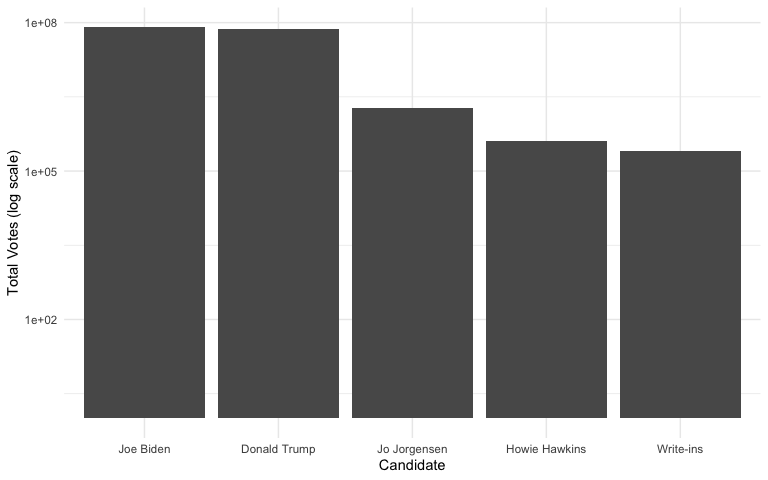<!-- -->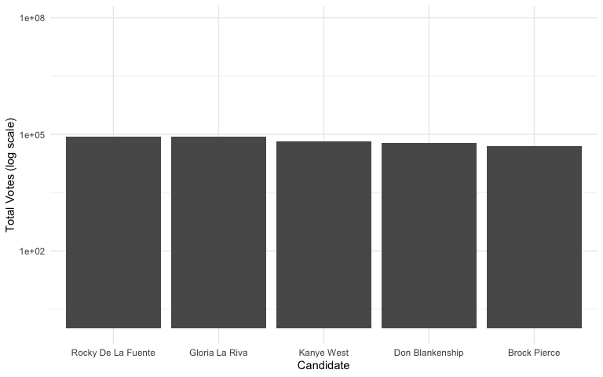<!-- --><!-- --><!-- -->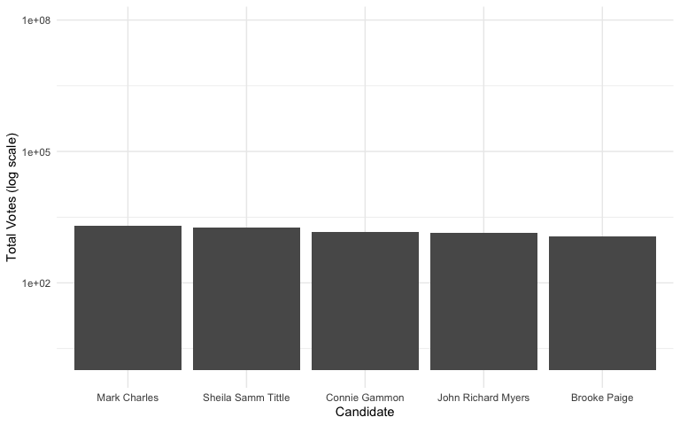<!-- -->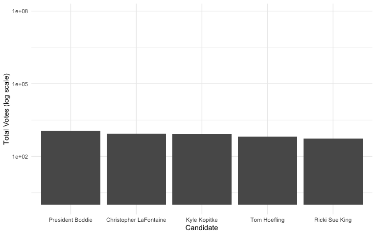<!-- -->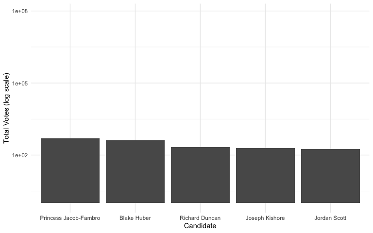<!-- -->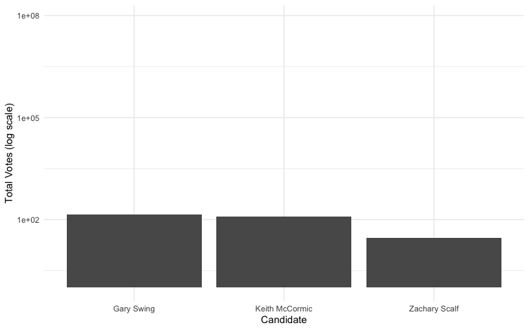<!-- -->

**5. (6 pts) Create data sets county.winner and state.winner by taking
the candidate with the highest proportion of votes in both county level
and state level. Hint: to create county.winner, start with election.raw,
group by state and county, compute total votes, and pct = votes/total as
the proportion of votes. Then choose the highest row using top_n
(variable state.winner is similar).**

    ## # A tibble: 6 × 7
    ##   state                county           candidate party total_votes  total   pct
    ##   <chr>                <chr>            <fct>     <fct>       <dbl>  <dbl> <dbl>
    ## 1 delaware             kent             Joe Biden DEM         44552  87025 0.512
    ## 2 delaware             new castle       Joe Biden DEM        195034 287633 0.678
    ## 3 delaware             sussex           Donald T… REP         71230 129352 0.551
    ## 4 district of columbia district of col… Joe Biden DEM         39041  41681 0.937
    ## 5 district of columbia ward 2           Joe Biden DEM         29078  32881 0.884
    ## 6 district of columbia ward 3           Joe Biden DEM         39397  44231 0.891

    ## # A tibble: 6 × 5
    ##   state      candidate    party total_state_votes   pct
    ##   <chr>      <fct>        <fct>             <dbl> <dbl>
    ## 1 alabama    Donald Trump REP             1441168 0.620
    ## 2 alaska     Donald Trump REP              189892 0.485
    ## 3 arizona    Joe Biden    DEM             1672143 0.494
    ## 4 arkansas   Donald Trump REP              760647 0.624
    ## 5 california Joe Biden    DEM            11109764 0.635
    ## 6 colorado   Joe Biden    DEM             1804352 0.554

# Visualization

Visualization is crucial for gaining insight and intuition during data
mining. We will map our data onto maps.

The R package ggplot2 can be used to draw maps. Consider the following
code.

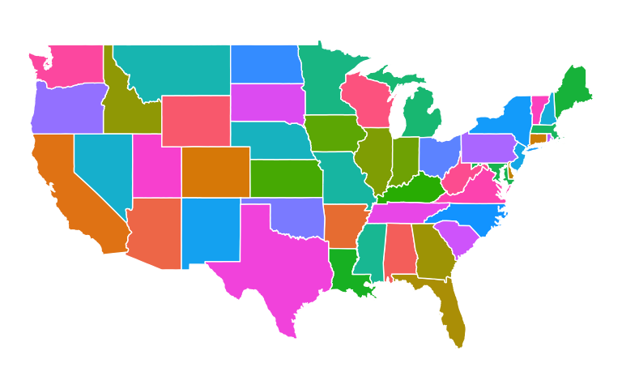<!-- -->

The variable states contain information to draw white polygons, and
fill-colors are determined by region.

**6. (4 pts) Use similar code to above to draw county-level map by
creating counties = map_data(“county”). Color by county.**

<!-- -->

Now color the map by the winning candidate for each state. First,
combine states variable and state.winner we created earlier using
left_join(). Note that left_join() needs to match up values of states to
join the tables. A call to left_join() takes all the values from the
first table and looks for matches in the second table. If it finds a
match, it adds the data from the second table; if not, it adds missing
values:

Here, we’ll be combing the two data sets based on state name. However,
the state names in states and state.winner can be in different formats:
check them! Before using left_join(), use certain transform to make sure
the state names in the two data sets: states (for map drawing) and
state.winner (for coloring) are in the same formats. Then left_join().
Your figure will look similar to New York Times map. .winner, state)

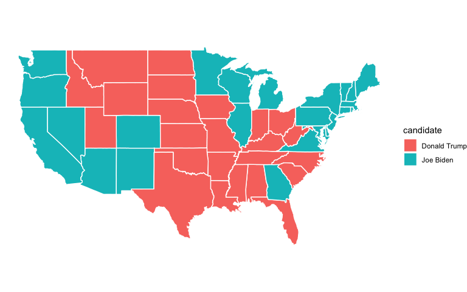<!-- -->

**8. (6 pts) Color the map of the state of California by the winning
candidate for each county.**

<!-- -->

**9. (4 pts) (Open-ended) Create a visualization of your choice using
census data.** Many exit polls noted that demographics played a big role
in the election. Use this Washington Post article and this R graph
gallery for ideas and inspiration.

    ## Warning: The `guide` argument in `scale_*()` cannot be `FALSE`. This was deprecated in
    ## ggplot2 3.3.4.
    ## ℹ Please use "none" instead.
    ## This warning is displayed once every 8 hours.
    ## Call `lifecycle::last_lifecycle_warnings()` to see where this warning was
    ## generated.

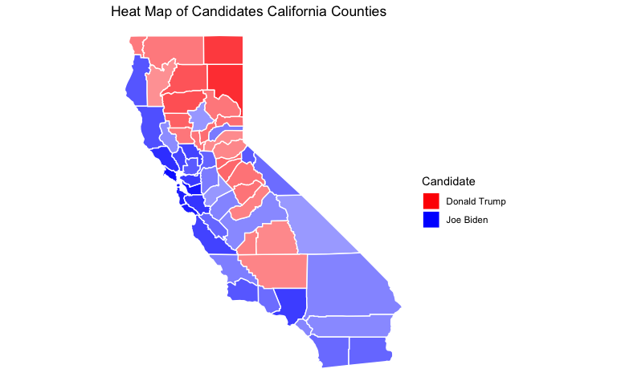<!-- -->

``` r
# Combine data into a single data frame
# Ensure that `pct` is a continuous variable representing the percentage
california_combined <- california %>%
  mutate(candidate_pct = ifelse(candidate == "Joe Biden", pct, -pct))

# Create the plot
cali_map <- ggplot(california_combined, aes(x = long, y = lat, fill = candidate_pct, group = group)) + 
  geom_polygon(color = "white") + 
  coord_fixed(1.3) +
  scale_fill_gradientn(colours = c("red", "white", "blue"), 
                       values = scales::rescale(c(-1, 0, 1)), 
                       breaks = c(-1, 0, 1),
                       labels = c("Trump", "Neutral", "Biden"),
                       limits = c(-1, 1),
                       na.value = "transparent") +
  theme_minimal() +
  labs(fill = "Vote %") +
  theme(text = element_text(size = 10)) +
  theme_void() +
  ggtitle("Heat Map of Candidates in California Counties")

# Print the plot
cali_map
```

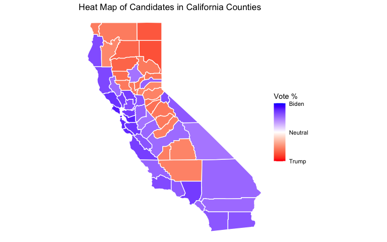<!-- -->

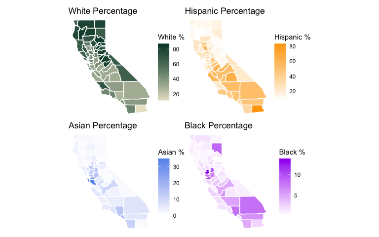<!-- -->

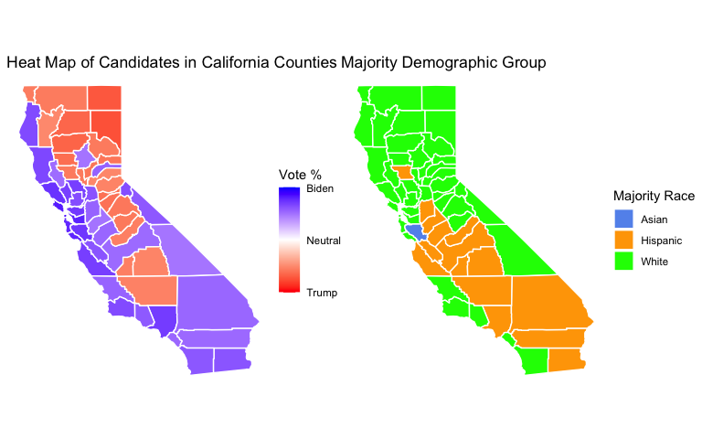<!-- -->

<!-- -->

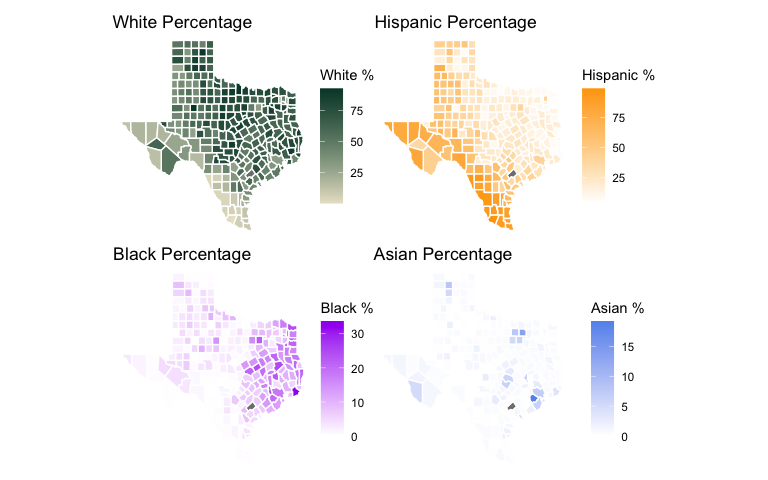<!-- -->

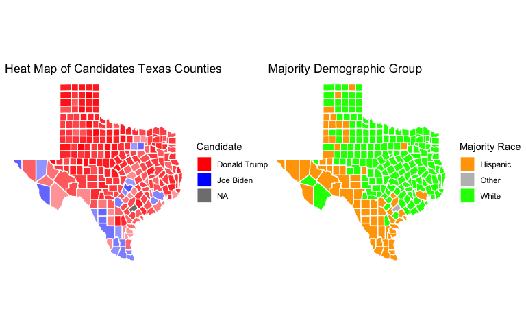<!-- -->

**10. The census data contains county-level census information. In this
problem, we clean and aggregate the information as follows.**

- (4 pts) Clean county-level census data census.clean: start with
  census, filter out any rows with missing values, convert {Men,
  Employed, VotingAgeCitizen} attributes to percentages, compute
  Minority attribute by combining {Hispanic, Black, Native, Asian,
  Pacific}, remove these variables after creating Minority, remove
  {IncomeErr, IncomePerCap, IncomePerCapErr, Walk, PublicWork,
  Construction}. Many columns are perfectly colineared, in which case
  one column should be deleted.

- (1 pts) Print the first 5 rows of census.clean:

<!-- -->

    ## # A tibble: 5 × 26
    ##   CountyId State   County       Men Women White Minority VotingAgeCitizen Income
    ##      <dbl> <chr>   <chr>      <dbl> <dbl> <dbl>    <dbl>            <dbl>  <dbl>
    ## 1     1001 Alabama Autauga C…  48.9  51.1  75.4     22.8             74.5  55317
    ## 2     1003 Alabama Baldwin C…  48.9  51.1  83.1     15.4             76.4  52562
    ## 3     1005 Alabama Barbour C…  53.3  46.7  45.7     52.8             77.4  33368
    ## 4     1007 Alabama Bibb Coun…  54.3  45.7  74.6     24.8             78.2  43404
    ## 5     1009 Alabama Blount Co…  49.4  50.6  87.4     10.9             73.7  47412
    ## # ℹ 17 more variables: Poverty <dbl>, ChildPoverty <dbl>, Professional <dbl>,
    ## #   Service <dbl>, Office <dbl>, Production <dbl>, Drive <dbl>, Carpool <dbl>,
    ## #   Transit <dbl>, OtherTransp <dbl>, WorkAtHome <dbl>, MeanCommute <dbl>,
    ## #   Employed <dbl>, PrivateWork <dbl>, SelfEmployed <dbl>, FamilyWork <dbl>,
    ## #   Unemployment <dbl>

# Dimensionality reduction

**11. Run PCA for the cleaned county level census data (with State and
County excluded).** (2 pts) Save the first two principle components PC1
and PC2 into a two-column data frame, call it pc.county. (2 pts) Discuss
whether you chose to center and scale the features before running PCA
and the reasons for your choice. (2 pts) What are the three features
with the largest absolute values of the first principal component? (2
pts) Which features have opposite signs and what does that mean about
the correlation between these features?

While some variables share the same scale, the rest do not. As a result,
we will center and scale our data before implementing PCA.

``` r
pr.out.census <- prcomp(temp_census.clean, scale=TRUE, center = TRUE)
```

Below are the three values with the largest absolute values of the first
principal component.

    ##              Men            Women VotingAgeCitizen 
    ##           0.4675           0.4675           0.3235

Below are the variables with negative values of the first principal
component.

    ##            Women            White VotingAgeCitizen          Poverty 
    ##         -0.46747         -0.13995         -0.32349         -0.14353 
    ##     ChildPoverty     Professional           Office            Drive 
    ##         -0.11912         -0.13413         -0.07762         -0.07346 
    ##       WorkAtHome     SelfEmployed       FamilyWork     Unemployment 
    ##         -0.22497         -0.29908         -0.20214         -0.06475

**Combine PCA results with county and state**

    ##   CountyId         County   State     PC1     PC2     PC3      PC4      PC5
    ## 1     1001 Autauga County Alabama  0.2576  1.2629  0.5960 -0.06454  0.36072
    ## 2     1003 Baldwin County Alabama  0.9397  1.3783  0.8209 -0.65453  1.32094
    ## 3     1005 Barbour County Alabama -3.8383 -0.3144 -1.3777  1.35737  0.19681
    ## 4     1007    Bibb County Alabama -1.2697  0.3803 -2.1657  1.95617  1.02423
    ## 5     1009  Blount County Alabama -0.3331  2.8055 -0.4877  0.41604  0.03168
    ## 6     1011 Bullock County Alabama -4.5639 -0.4862 -1.3311  2.72115 -1.55738
    ##       PC6      PC7      PC8      PC9     PC10    PC11     PC12    PC13     PC14
    ## 1 -0.4291 -0.18432  0.33816 -0.03633  0.36346  0.5726 -0.18996 -0.5454 -0.01721
    ## 2 -0.2536 -0.09437  0.48219  0.29354 -0.01565 -0.0614  0.45349  0.2316  0.31253
    ## 3 -0.4923  0.34694 -0.87831  0.92535 -0.15190 -0.5139 -0.85926  0.1346 -0.80957
    ## 4  0.0875  1.02609 -0.95859  0.46454  0.02073  0.4749  0.01344 -0.5661 -0.29565
    ## 5 -0.1853  1.59668 -0.03545  0.96000  0.29349  0.1500 -0.15764 -0.2403  0.73077
    ## 6  0.4290  1.52401 -0.66577  0.55263  0.48685 -0.5483 -0.22163  1.4228 -2.47939
    ##       PC15     PC16     PC17     PC18     PC19     PC20   PC21       PC22
    ## 1  0.13382  0.31326 -0.04651 -0.19324 -0.31777  0.02789 0.1234 -0.0184658
    ## 2  0.24074  0.05314  0.40677  0.18295 -0.11654  0.06923 0.1055 -0.0119941
    ## 3 -0.16202 -0.32525 -0.09004 -0.29370 -0.06238 -0.22986 0.2905 -0.0006574
    ## 4 -0.03449 -0.21968  0.25149  0.01529  0.06687 -0.25356 0.1997 -0.0252546
    ## 5  0.72551  0.37377  0.32001  0.08565  0.30909  0.22032 0.2060  0.0106675
    ## 6  0.73250 -0.39641 -0.29940  0.31845  0.17307 -0.20061 0.5031 -0.0056433
    ##        PC23
    ## 1 5.747e-15
    ## 2 9.767e-15
    ## 3 4.704e-15
    ## 4 1.832e-15
    ## 5 7.066e-15
    ## 6 1.986e-15

**12. (2 pts) Determine the number of minimum number of PCs needed to
capture 90% of the variance for the analysis.** (2 pts) Plot proportion
of variance explained (PVE) and cumulative PVE.

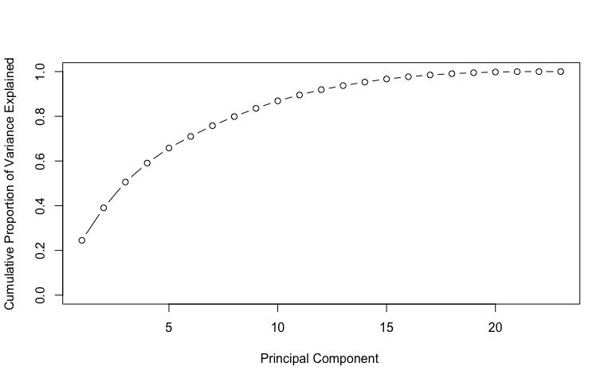<!-- -->

We need about 12 PCs in order to explain 90% of the total variation in
the data.

# Clustering

**13. (2 pts) With census.clean (with State and County excluded),
perform hierarchical clustering with complete linkage.** (2 pts) Cut the
tree to partition the observations into 10 clusters. (2 pts) Re-run the
hierarchical clustering algorithm using the first 2 principal components
from pc.county as inputs instead of the original features. (2 pts)
Compare the results and comment on your observations. For both
approaches investigate the cluster that contains Santa Barbara County.
(2 pts) Which approach seemed to put Santa Barbara County in a more
appropriate clusters? Comment on what you observe and discuss possible
explanations for these observations.

Below is census.clean (with State and County excluded):

    ## clus
    ##    1    2    3    4    5    6    7    8    9   10 
    ## 2612   91    6  278  177   11    6   32    5    1

Below is using the first 2 principal components:

    ## clus_new
    ##    1    2    3    4    5    6    7    8    9   10 
    ## 1022 1070   93   89  103  392   16    1  416   17

Which approach seemed to put Santa Barbara County in a more appropriate
clusters?
$\underset{\phi_{11},... ,\phi_{p1}}{\max} \frac{1}{n} \sum_{i=1}^{n} (\sum_{j=1}^{p} \phi_{j1}x_{ij})^2$

**Answer: Santa Barbara County was placed into cluster 1 for the regular
hierarchical clustering. For hierarchical clustering using pc.county,
Santa Barbara County was placed into cluster 6. Using the first 2
principal components (2PC) seems to place Santa Barbara County in a more
appropriate cluster than the non-first 2 principal components (Non-2PC).
Creating a table for each one, we can see -2PC has many values for
clusters 1 and 2, yet there are rarely any for clusters 3-10. On the
other hand, 2PC has many values for clusters 1-4, though, for clusters
5-10, there are rarely any as well. For Non-2PC, cluster 1 and cluster 2
are over-saturated, but 2PC resolved this issue better, though not
entirely**

### The Elbow Method

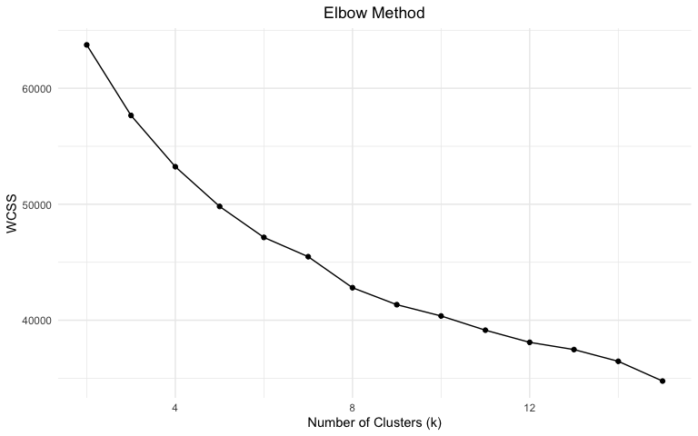<!-- -->

# Classification

We start considering supervised learning tasks now. The most
interesting/important question to ask is: can we use census information
in a county to predict the winner in that county?

In order to build classification models, we first need to combine
county.winner and census.clean data. This seemingly straightforward task
is harder than it sounds. For simplicity, the following code makes
necessary changes to merge them into election.cl for classification.

**14. Understand the code above. (3 pts) Why do we need to exclude the
predictor party from election.cl?**

**Answer:** **Because of the statement: “can we use census information
in a county to predict the winner in that county?” The party predictor
informs us about the candidate’s party affiliation, not about the
county’s party affiliation. If the predictor variable party was about
the county, then we could possibly use it.**

# Classification

Using the following code, partition data into 80% training and 20%
testing:

Use the following code to define 10 cross-validation folds:

Using the following error rate function. And the object records is used
to record the classification performance of each method in the
subsequent problems.

**15. Decision tree: (2 pts) train a decision tree by cv.tree().** (2
pts) Prune tree to minimize misclassification error. Be sure to use the
folds from above for cross-validation. (2 pts) Visualize the trees
before and after pruning. (1 pts) Save training and test errors to
records object. (2 pts) Interpret and discuss the results of the
decision tree analysis. (2 pts) Use this plot to tell a story about
voting behavior.

Decision Tree purity

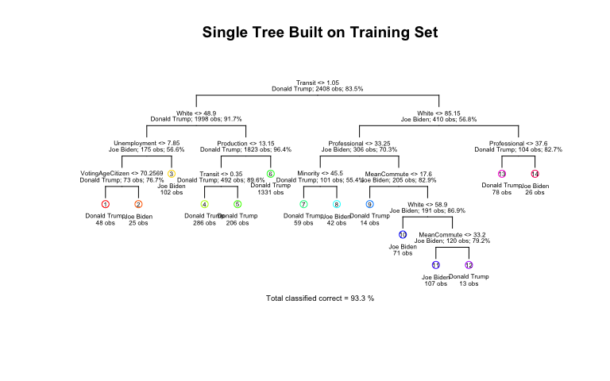<!-- -->

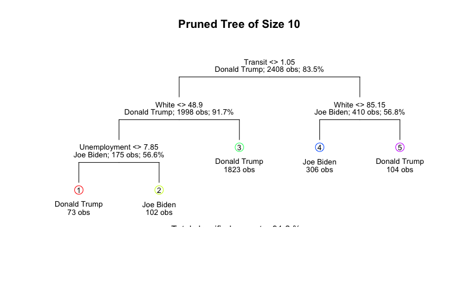<!-- -->

``` r
cv_data <- data.frame(
  size = cv.election$size,
  error = cv.election$dev
)

# Create the plot
ggplot(cv_data, aes(x = size, y = error)) +
  geom_line(linewidth = 0.8) +
  geom_point(size = 3) +
  theme_minimal() +
  labs(
    title = "Cross-Validation Error vs Tree Size",
    x = "Tree Size",
    y = "Cross-Validation Error"
  ) +
  theme(
    plot.title = element_text(hjust = 0.5, size = 14, face = "bold"),
    axis.title = element_text(size = 12),
    axis.text = element_text(size = 10),
    panel.grid.minor = element_blank()
  ) +
  scale_x_continuous(breaks = unique(cv_data$size)) +  # Show all tree sizes on x-axis
  geom_point(
    data = cv_data[which.min(cv_data$error), ],
    aes(x = size, y = error),
    color = "red",
    size = 4
  )  # Highlight the minimum error point
```

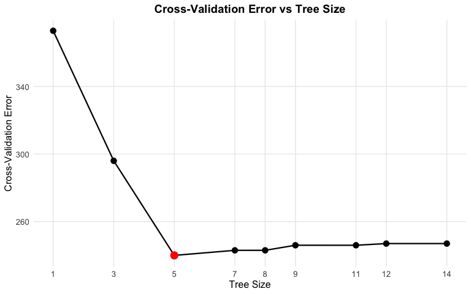<!-- -->

**Both trees have Transit first followed by White and Women. Before
pruning, White was right below Women, but in after pruning, White is at
the very bottom of Women. Minority is still at the same place. In after
pruning, Professional is not in the White split, but Professional is
still in the Women split. Women is absent in the White split. Men is
also absent in the White split.**

**It seems White was a big contributing factor if you were going to vote
for Trump, while it seems Women was a big contributing factor if you
were going to vote for Biden.**

    ##               
    ## pred.test.tree Donald Trump Joe Biden
    ##   Donald Trump          464        26
    ##   Joe Biden              38        74

**16. (2 pts) Run a logistic regression to predict the winning candidate
in each county.** (1 pts) Save training and test errors to records
variable. (1 pts) What are the significant variables? (1 pts) Are they
consistent with what you saw in decision tree analysis? (2 pts)
Interpret the meaning of a couple of the significant coefficients in
terms of a unit change in the variables.

For interpretable machine learning

    ##                    Estimate Std. Error  z value  Pr(>|z|)
    ## (Intercept)      -3.614e+01  9.596e+00 -3.76657 1.655e-04
    ## Men               7.494e-02  5.092e-02  1.47177 1.411e-01
    ## White            -1.749e-01  6.947e-02 -2.51787 1.181e-02
    ## Minority         -3.736e-02  6.800e-02 -0.54948 5.827e-01
    ## VotingAgeCitizen  1.898e-01  2.722e-02  6.97507 3.057e-12
    ## Income           -7.805e-06  1.639e-05 -0.47627 6.339e-01
    ## Poverty           3.148e-02  4.325e-02  0.72786 4.667e-01
    ## ChildPoverty      1.439e-02  2.533e-02  0.56830 5.698e-01
    ## Professional      3.294e-01  3.855e-02  8.54408 1.296e-17
    ## Service           3.718e-01  4.828e-02  7.69947 1.366e-14
    ## Office            1.543e-01  4.692e-02  3.28830 1.008e-03
    ## Production        1.899e-01  4.179e-02  4.54413 5.516e-06
    ## Drive            -1.997e-01  4.951e-02 -4.03271 5.514e-05
    ## Carpool          -1.855e-01  6.089e-02 -3.04697 2.312e-03
    ## Transit           5.373e-02  1.001e-01  0.53708 5.912e-01
    ## OtherTransp      -2.734e-03  1.035e-01 -0.02642 9.789e-01
    ## WorkAtHome       -5.869e-02  7.187e-02 -0.81668 4.141e-01
    ## MeanCommute       5.043e-02  2.382e-02  2.11710 3.425e-02
    ## Employed          2.865e-01  3.425e-02  8.36541 5.991e-17
    ## PrivateWork       1.008e-01  2.170e-02  4.64750 3.360e-06
    ## SelfEmployed      8.590e-04  4.509e-02  0.01905 9.848e-01
    ## FamilyWork       -4.964e-01  2.901e-01 -1.71091 8.710e-02
    ## Unemployment      2.799e-01  5.037e-02  5.55713 2.743e-08

Below are the significant variables:

    ## Unemployment     Employed Professional      Service   FamilyWork 
    ##       0.2799       0.2865       0.3294       0.3718       0.4964

White is included, but Women and Minority are not among the top 5. It
does deviate from the Decision Tree analysis.

If were to increase Production by one unit, holding the rest fixed, then
applying the same logic to Professional, Employed, Service, and
Unemployment, we would get percent in the odds:

    ##   Production Unemployment     Employed Professional      Service 
    ##        20.91        32.30        33.18        39.01        45.03

**17. You may notice that you get a warning glm.fit: fitted
probabilities numerically 0 or 1 occurred.** As we discussed in class,
this is an indication that we have perfect separation (some linear
combination of variables perfectly predicts the winner). This is usually
a sign that we are overfitting. One way to control overfitting in
logistic regression is through regularization.

(3 pts) Use the cv.glmnet function from the glmnet library to run a
10-fold cross validation and select the best regularization parameter
for the logistic regression with LASSO penalty. Set lambda = seq(1, 50)
\* 1e-4 in cv.glmnet() function to set pre-defined candidate values for
the tuning parameter λ.

(1 pts) What is the optimal value of λ in cross validation? (1 pts) What
are the non-zero coefficients in the LASSO regression for the optimal
value of λ? (1 pts) How do they compare to the unpenalized logistic
regression? (1 pts) Comment on the comparison. (1 pts) Save training and
test errors to the records variable.

The optimal value of $\lambda$ in cross validation is 0.0011.

Below are the non-zero coefficients in the LASSO regression for the
optimal value of λ:

    ##      (Intercept)              Men            Women            White 
    ##       -3.446e+01        2.584e-02       -8.838e-15       -1.260e-01 
    ## VotingAgeCitizen          Poverty     Professional          Service 
    ##        1.791e-01        4.838e-02        2.679e-01        3.054e-01 
    ##           Office       Production            Drive          Carpool 
    ##        1.075e-01        1.301e-01       -1.424e-01       -1.200e-01 
    ##          Transit      OtherTransp      MeanCommute         Employed 
    ##        1.036e-01        3.025e-02        2.831e-02        2.457e-01 
    ##      PrivateWork     SelfEmployed       FamilyWork     Unemployment 
    ##        8.855e-02       -1.517e-02       -4.299e-01        2.456e-01

``` r
set.seed(20)

# Predict probabilities for training and test datasets
prob.training <- predict(lasso.model, type = "response", s = bestlam, newx = x.train)
prob.test <- predict(lasso.model, type = "response", s = bestlam, newx = x.test)

# Generate predictions using majority rule
majority_rule <- 0.5
pred_training <- ifelse(prob.training > majority_rule, "Joe Biden", "Donald Trump")
pred_test <- ifelse(prob.test > majority_rule, "Joe Biden", "Donald Trump")
```

``` r
# Training set confusion matrix and error calculation
training_pred_table <- table(Predicted = pred_training, True = election.tr$candidate)
percent_train <- sum(diag(training_pred_table)) / nrow(election.tr) * 100

# Test set confusion matrix and error calculation
test_pred_table <- table(Predicted = pred_test, True = election.te$candidate)
percent_test <- sum(diag(test_pred_table)) / nrow(election.te) * 100
```

Unpenalized logistic regression: When taking their absolute values,
Women and Income had low coefficients compared to the rest of the
variables. Excluding these two, the other variables were within range of
each other.

LASSO regression: Minority, Income, WorkAtHome, and MeanCommute had zero
coefficients.

It does seem Income is not an important metric. White has been
consistently shown as being an important variable.

**18. (6 pts) Compute ROC curves for the decision tree, logistic
regression and LASSO logistic regression using predictions on the test
data.** Display them on the same plot. (2 pts) Based on your
classification results, discuss the pros and cons of the various
methods. (2 pts) Are the different classifiers more appropriate for
answering different kinds of questions about the election?

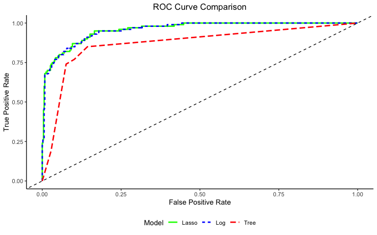<!-- -->

**Answer:**

**Answer: **

# Taking it further

This part will be worth up to a 20% of your final project grade!

**19. (9 pts) Explore additional classification methods.** Consider
applying additional two classification methods from KNN, LDA, QDA, SVM,
random forest, boosting, neural networks etc. (You may research and use
methods beyond those covered in this course). How do these compare to
the tree method, logistic regression, and the lasso logistic regression?

### Random Forest

### Neural Net

    ## Loading required package: foreach

    ## 
    ## Attaching package: 'foreach'

    ## The following objects are masked from 'package:purrr':
    ## 
    ##     accumulate, when

    ## Loading required package: iterators

``` r
# Storing Error Rates
a <- calc_error_rate(as.factor(train_pred), election.tr$candidate)
b <- calc_error_rate(as.factor(test_pred), election.te$candidate)
records[5,] <- c(a,b)

roc_pred_nn <- prediction(
    predictions = test_pred_prob,
    labels = election.te$candidate #as.factor(election.te$candidate, levels = c("Donald Trump", "Joe Biden"))
)

roc_perf_nn <- performance(roc_pred_nn, measure = "tpr", x.measure = "fpr")
```

``` r
# Modify factor levels to be valid R names
election.tr$candidate <- factor(election.tr$candidate,
                              levels = c("Donald Trump", "Joe Biden"),
                              labels = c("Donald_Trump", "Joe_Biden"))

election.te$candidate <- factor(election.te$candidate,
                              levels = c("Donald Trump", "Joe Biden"),
                              labels = c("Donald_Trump", "Joe_Biden"))

# Setup parallel processing
num_cores <- availableCores(omit = 1)  # Leave one core free
cl <- makeCluster(num_cores)
registerDoParallel(cl)

# Create training control object
ctrl <- trainControl(
  method = "cv",
  number = 10,
  classProbs = TRUE,
  summaryFunction = twoClassSummary,
  verboseIter = TRUE,
  allowParallel = TRUE
)

# Define grid of hyperparameters
grid <- expand.grid(
  size = c(3, 5, 7, 10, 13),
  decay = c(0.001, 0.01, 0.1, 0.3, 0.5)
)

# Set seed for reproducibility
set.seed(123)

# Train model with grid search
nnet_optimal <- train(
  x = X_train_scaled,
  y = election.tr$candidate,
  method = "nnet",
  metric = "ROC",
  trControl = ctrl,
  tuneGrid = grid,
  trace = FALSE,
  maxit = 1000,
  linout = FALSE,
  MaxNWts = 1000
)
```

    ## Aggregating results
    ## Selecting tuning parameters
    ## Fitting size = 7, decay = 0.5 on full training set

    ## Warning: Setting row names on a tibble is deprecated.

``` r
# Stop parallel processing
stopCluster(cl)


# Make predictions with optimal model
train_pred_prob <- predict(nnet_optimal, X_train_scaled, type = "prob")[,"Joe_Biden"]
test_pred_prob <- predict(nnet_optimal, X_test_scaled, type = "prob")[,"Joe_Biden"]

# Calculate error rates
train_pred <- ifelse(train_pred_prob > 0.5, "Joe_Biden", "Donald_Trump")
test_pred <- ifelse(test_pred_prob > 0.5, "Joe_Biden", "Donald_Trump")
```

``` r
# Plot tuning results
plot(nnet_optimal)
```

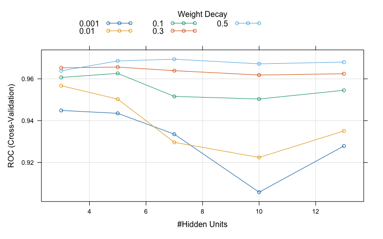<!-- -->

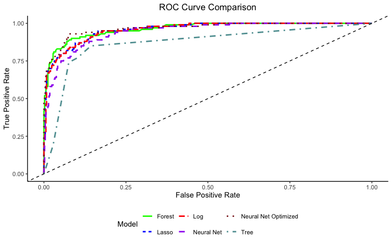<!-- -->

**Answer:**

**Plotting the ROC Curve for all the methods, we see that our CV
Decision Tree performs the worst, then Random Forest. After that, it’s a
matter of personal preference. Random Forest does outperform CV Decision
Tree throughout the ROC Curve. In my opinion Decision Tree and Random
Forest would not be suitable for our problem since we already narrowed
it down to two candidates. I still think LASSO Logistic Regression is
the most optimal, followed by our regular Logistic Regression.**

**20. (9 pts) Tackle at least one more interesting question. Creative
and thoughtful analysis will be rewarded!** Some possibilities for
further exploration are:

- Conduct an exploratory analysis of the “purple” counties – the “battle
  ground” / “swing counties”: which the models predict Biden and Trump
  were roughly equally likely to win. What is it about these counties
  that make them hard to predict?

Arizona, Florida, Michigan, Pennsylvania, Wisconsin New Hampshire, North
Carolina, Georgia, and Minnesota are swing states (battle ground
states). “arizona”, “florida”, “michigan”, “pennsylvania”, “wisconsin”,
“new hampshire”, “north carolina”, “minnesota”, “georgia”. “Arizona”,
“Florida”, “Michigan”, “Pennsylvania”, “Wisconsin”, “New Hampshire”,
“North Carolina”, “Minnesota”, “Georgia”

[Voter turnout in United States presidential
elections](https://en.wikipedia.org/wiki/Voter_turnout_in_United_States_presidential_elections)

**Answer: I will use voter turnout as % of VAP**

**As the maps illustrate, Joe Biden won 7/9 battle ground states while
Trump won 2/9. If we were to compare this to the 2016 election, Trump
won Arizona, Wisconsin, Pennsylvania, Michigan, Georgia. All these
states flipped for the 2020 election, which Biden ended up winning the
2020 election.**

**One of the difficulties of predicting these counties/states is that
future events such as war, natural disasters, pandemics are
unpredictable. The COVID-19 pandemic drastically altered the 2020
election since voting became a lot easier to do. The 2016 election had a
voter turnout of 54.8%, but the 2020 election had a voter turnout of
62.0%. The 2008 election had a voter turnout of 57.1%, but the 2012
election had a voter turnout of 53.8%. Unlike the 2012 run of Obama, the
2020 run of Trump saw an increase in voter turnout, but at the detriment
of Trump.**

**Below are a list of articles and research papers on census if you are
interested. In my opinion, these are important finding that will
determine future elections:**

[The Male Non-Working Class A Disquieting
Survey](https://www.milkenreview.org/articles/the-male-non-working-class)

[GOP favored by married people, Dems strongly supported by unmarried
women, exit polls
show](https://katv.com/news/nation-world/gop-favored-by-married-people-while-dems-strongly-supported-by-unmarried-women-exit-polls)

[All the Single Democratic
Ladies](https://www.aei.org/op-eds/all-the-single-democratic-ladies/)

[Rising Share of U.S. Adults Are Living Without a Spouse or
Partner](https://www.pewresearch.org/social-trends/2021/10/05/rising-share-of-u-s-adults-are-living-without-a-spouse-or-partner/)

[In Changing U.S. Electorate, Race and Education Remain Stark Dividing
Lines](https://www.pewresearch.org/politics/2020/06/02/in-changing-u-s-electorate-race-and-education-remain-stark-dividing-lines/)

[Turnout in 2020 election spiked among both Democratic and Republican
voting groups, new census data
shows](https://www.brookings.edu/research/turnout-in-2020-spiked-among-both-democratic-and-republican-voting-groups-new-census-data-shows/)

[Latinos support Democrats over Republicans 2-1 in House and Senate
elections](https://www.brookings.edu/blog/fixgov/2022/11/11/latinos-support-democrats-over-republicans-2-1-in-house-and-senate-elections/)

[Are Latinos becoming more Republican? Or just more
American](https://thehill.com/opinion/campaign/3715068-are-latinos-becoming-more-republican-or-just-more-american/)

[The new swing vote: Why more Latino voters are joining the
GOP](https://www.csmonitor.com/USA/Politics/2022/1021/The-new-swing-vote-Why-more-Latino-voters-are-joining-the-GOP)

[The Latino vote shifted toward Republicans in 2020. Will it
again?](https://www.washingtonpost.com/politics/interactive/2022/election-2022-latino-voters/)
