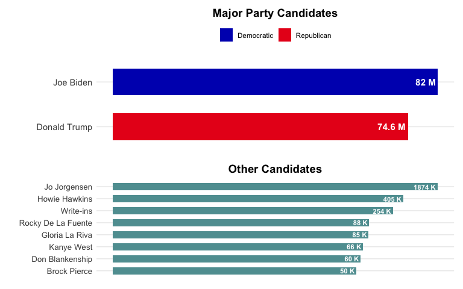
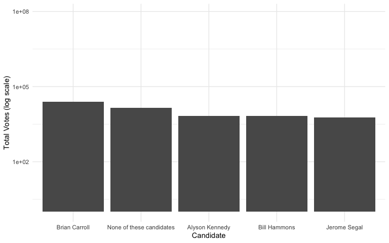
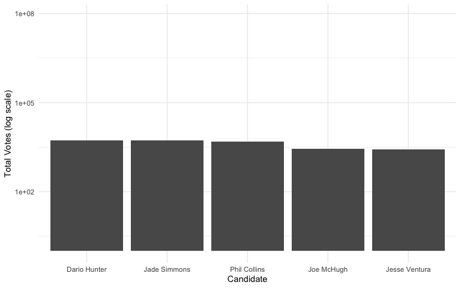
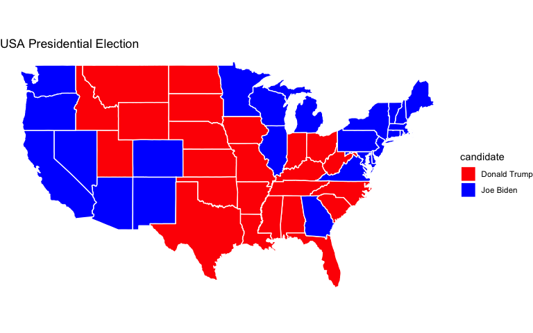
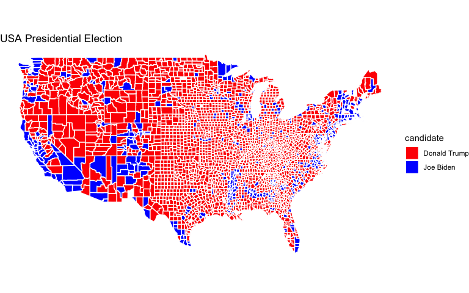
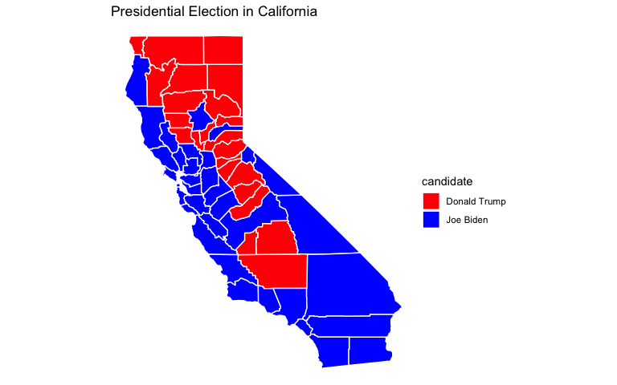
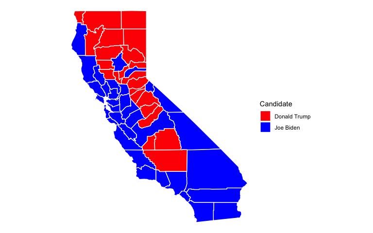
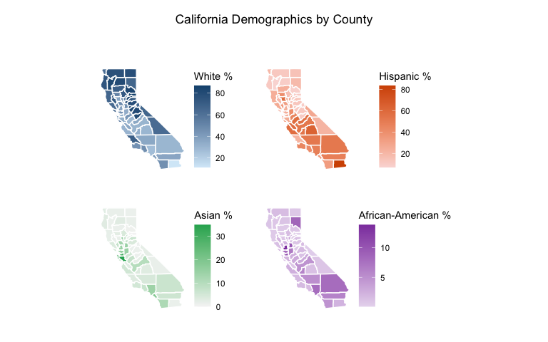
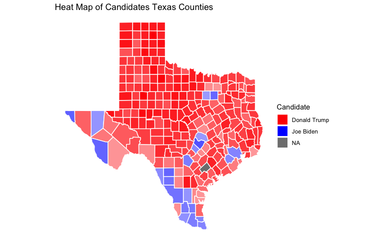
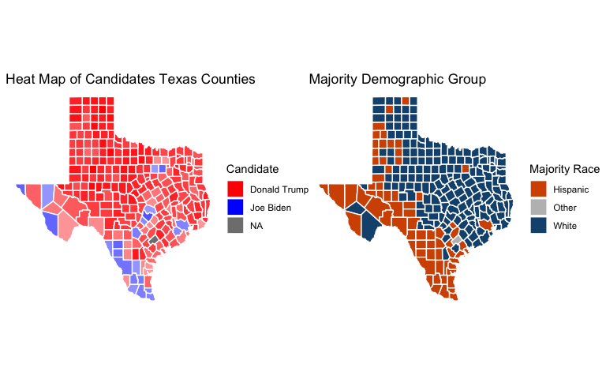

Analysis of the 2020 Presidential Election
================
Alexander Sanchez
2030-01-01

# Instructions and Expectations

Predicting voter behavior is complicated for many reasons despite the
tremendous effort in collecting, cleaning, analyzing, and understanding
many available datasets. As the midterm elections in the United States
is currently being held near the midpoint of the current president’s
four-year term of office, it is a good time for us to review the 2020
United States presidential election data! Despite that the 2016
presidential election came as a big surprise to many, Biden’s victory in
the 2020 presidential election has been widely predicted (e.g., see the
well-known Nate Silver in FiveThirtyEight).

# Data

We will start the analysis with two data sets. The first one is the
election data, which is drawn from here. The data contains county-level
election results.

The second dataset is the 2017 United States county-level census data,
which is available here.

The following code load in these two data sets: `election.raw` and
`census.`

    ## [1] "/Users/dsanch/GitHub_Projects/2020_presidential_election"

# Exploratory Data Analysis

## Election Data

**1. (1 pts) Compute the total number of distinct values in state in
election.raw to verify that the data contains all states and a federal
district**

The following is the first few rows of the `election.raw` data.

    ## # A tibble: 6 × 5
    ##   state    county     candidate     party total_votes
    ##   <chr>    <chr>      <fct>         <fct>       <dbl>
    ## 1 Delaware Kent       Joe Biden     DEM         44552
    ## 2 Delaware Kent       Donald Trump  REP         41009
    ## 3 Delaware Kent       Jo Jorgensen  LIB          1044
    ## 4 Delaware Kent       Howie Hawkins GRN           420
    ## 5 Delaware New Castle Joe Biden     DEM        195034
    ## 6 Delaware New Castle Donald Trump  REP         88364

Checking dimensions of `election.raw` data set.

    ## [1] 32177     5

Checking for missing values in `election.raw` data set.

    ## [1] "There are no missing values"

Checking unique vlaues for each column

    ##       state      county   candidate       party total_votes 
    ##          51        2825          38          26        6762

## Census data

The following is the first few rows of the `census` data. The column
names are all very self-explanatory:

    ## # A tibble: 6 × 37
    ##   CountyId State  County TotalPop   Men  Women Hispanic White Black Native Asian
    ##      <dbl> <chr>  <chr>     <dbl> <dbl>  <dbl>    <dbl> <dbl> <dbl>  <dbl> <dbl>
    ## 1     1001 Alaba… Autau…    55036 26899  28137      2.7  75.4  18.9    0.3   0.9
    ## 2     1003 Alaba… Baldw…   203360 99527 103833      4.4  83.1   9.5    0.8   0.7
    ## 3     1005 Alaba… Barbo…    26201 13976  12225      4.2  45.7  47.8    0.2   0.6
    ## 4     1007 Alaba… Bibb …    22580 12251  10329      2.4  74.6  22      0.4   0  
    ## 5     1009 Alaba… Bloun…    57667 28490  29177      9    87.4   1.5    0.3   0.1
    ## 6     1011 Alaba… Bullo…    10478  5616   4862      0.3  21.6  75.6    1     0.7
    ## # ℹ 26 more variables: Pacific <dbl>, VotingAgeCitizen <dbl>, Income <dbl>,
    ## #   IncomeErr <dbl>, IncomePerCap <dbl>, IncomePerCapErr <dbl>, Poverty <dbl>,
    ## #   ChildPoverty <dbl>, Professional <dbl>, Service <dbl>, Office <dbl>,
    ## #   Construction <dbl>, Production <dbl>, Drive <dbl>, Carpool <dbl>,
    ## #   Transit <dbl>, Walk <dbl>, OtherTransp <dbl>, WorkAtHome <dbl>,
    ## #   MeanCommute <dbl>, Employed <dbl>, PrivateWork <dbl>, PublicWork <dbl>,
    ## #   SelfEmployed <dbl>, FamilyWork <dbl>, Unemployment <dbl>

**2. (1 pts) Report the dimension of `census`. (1 pts) Are there missing
values in the data set? (1 pts) Compute the total number of distinct
values in `county` in `census`. (1 pts) Compare the values of total
number of distinct county in `census` with that in `election.raw`. (1
pts) Comment on your findings.**

Checking dimensions of `census` data set.

    ## [1] 3220   37

Checking for missing values in `census` data set.

    ## [1] "There are missing values"

Which column has missing values?

    ## ChildPoverty 
    ##            1

    ## County 
    ##   1955

There are more distinct counties in `election.raw` than in `census`.
Grouping them by state and county (some states have the same county
names), `census` has around 3,220 counties, while `election.raw` has
4,633 counties. Upon closer examination of state and county, we see that
some counties are named differently despite being from the same state
county. Also, `census` has one more state than `election.raw` since
`census` includes Puerto Rico.

# Data Wrangling

**3. (4 pts) Construct aggregated data sets from election.raw data:
i.e.,**

- Keep the county-level data as it is in election.raw.
- Create a state-level summary into a election.state.
- Create a federal-level summary into a election.total.

<!-- -->

    ##      candidate  county   state total_votes
    ## 1 Donald Trump Autauga Alabama       19838
    ## 2 Jo Jorgensen Autauga Alabama         350
    ## 3    Joe Biden Autauga Alabama        7503
    ## 4    Write-ins Autauga Alabama          79
    ## 5 Donald Trump Baldwin Alabama       83544
    ## 6 Jo Jorgensen Baldwin Alabama        1229

    ##         candidate   state total_votes
    ## 1    Donald Trump Alabama     1441168
    ## 2    Jo Jorgensen Alabama       25176
    ## 3       Joe Biden Alabama      849648
    ## 4       Write-ins Alabama        7312
    ## 5    Brock Pierce  Alaska         825
    ## 6 Don Blankenship  Alaska        1127

**4. (1 pts) How many named presidential candidates were there in the
2020 election? (2 pts) Draw a bar chart of all votes received by each
candidate. You can split this into multiple plots or may prefer to plot
the results on a log scale. Either way, the results should be clear and
legible! (For fun: spot Kanye West among the presidential candidates!)**

There were about 36 presidential candidates in the 2020 election, not
counting write-ins and none of these candidates.

    ## There were 37 named presidential candidates in the 2020 election.

    ## # A tibble: 6 × 2
    ##   candidate          total_votes
    ##   <fct>                    <dbl>
    ## 1 Joe Biden             82046434
    ## 2 Donald Trump          74585705
    ## 3 Jo Jorgensen           1874183
    ## 4 Howie Hawkins           404835
    ## 5 Write-ins               254274
    ## 6 Rocky De La Fuente       88158

<!-- --><!-- --><!-- --><!-- --><!-- --><!-- --><!-- --><!-- -->

**5. (6 pts) Create data sets county.winner and state.winner by taking
the candidate with the highest proportion of votes in both county level
and state level. Hint: to create county.winner, start with election.raw,
group by state and county, compute total votes, and pct = votes/total as
the proportion of votes. Then choose the highest row using top_n
(variable state.winner is similar).**

    ## # A tibble: 6 × 7
    ##   state                county           candidate party total_votes  total   pct
    ##   <chr>                <chr>            <fct>     <fct>       <dbl>  <dbl> <dbl>
    ## 1 delaware             kent             Joe Biden DEM         44552  87025 0.512
    ## 2 delaware             new castle       Joe Biden DEM        195034 287633 0.678
    ## 3 delaware             sussex           Donald T… REP         71230 129352 0.551
    ## 4 district of columbia district of col… Joe Biden DEM         39041  41681 0.937
    ## 5 district of columbia ward 2           Joe Biden DEM         29078  32881 0.884
    ## 6 district of columbia ward 3           Joe Biden DEM         39397  44231 0.891

    ## # A tibble: 6 × 5
    ##   state      candidate    party total_state_votes   pct
    ##   <chr>      <fct>        <fct>             <dbl> <dbl>
    ## 1 alabama    Donald Trump REP             1441168 0.620
    ## 2 alaska     Donald Trump REP              189892 0.485
    ## 3 arizona    Joe Biden    DEM             1672143 0.494
    ## 4 arkansas   Donald Trump REP              760647 0.624
    ## 5 california Joe Biden    DEM            11109764 0.635
    ## 6 colorado   Joe Biden    DEM             1804352 0.554

# Visualization

Visualization is crucial for gaining insight and intuition during data
mining. We will map our data onto maps.

The R package ggplot2 can be used to draw maps. Consider the following
code.

<!-- -->

The variable states contain information to draw white polygons, and
fill-colors are determined by region.

**6. (4 pts) Use similar code to above to draw county-level map by
creating counties = map_data(“county”). Color by county.**

<!-- -->

Now color the map by the winning candidate for each state. First,
combine states variable and state.winner we created earlier using
left_join(). Note that left_join() needs to match up values of states to
join the tables. A call to left_join() takes all the values from the
first table and looks for matches in the second table. If it finds a
match, it adds the data from the second table; if not, it adds missing
values:

Here, we’ll be combing the two data sets based on state name. However,
the state names in states and state.winner can be in different formats:
check them! Before using left_join(), use certain transform to make sure
the state names in the two data sets: states (for map drawing) and
state.winner (for coloring) are in the same formats. Then left_join().
Your figure will look similar to New York Times map. .winner, state)

<!-- -->

**8. (6 pts) Color the map of the state of California by the winning
candidate for each county.**

<!-- -->

<!-- -->

**9. (4 pts) (Open-ended) Create a visualization of your choice using
census data.** Many exit polls noted that demographics played a big role
in the election. Use this Washington Post article and this R graph
gallery for ideas and inspiration.

    ## Warning: The `guide` argument in `scale_*()` cannot be `FALSE`. This was deprecated in
    ## ggplot2 3.3.4.
    ## ℹ Please use "none" instead.
    ## This warning is displayed once every 8 hours.
    ## Call `lifecycle::last_lifecycle_warnings()` to see where this warning was
    ## generated.

<!-- -->

<!-- -->

<!-- -->

<!-- -->

<!-- -->

<!-- -->

<!-- -->

# Data Cleaning

We start by cleaning the county-level census data through several
transformations. Initially, we remove any rows with missing values using
`na.omit()` and `filter()`. Then, we convert three attributes (Men,
Employed, and VotingAgeCitizen) to percentages by dividing each by
TotalPop and multiplying by 100. The code creates a new Minority
attribute by combining Hispanic, Black, Native, Asian, and Pacific
populations and removes these original variables after creating the
Minority column using the `.keep = "unused" argument.` The Minority
column is then relocated to appear after the White column for better
organization.

The code removes several specified columns that are not needed for the
analysis: IncomeErr, IncomePerCap, IncomePerCapErr, Walk, PublicWork,
and Construction.

``` r
census.clean <- census %>%
  na.omit() %>%
  filter(if_any(everything(), ~ !is.na(.))) %>%
  mutate(Men = (Men/TotalPop) * 100) %>%
  mutate(Women = (Women/TotalPop) * 100) %>%
  mutate(Employed = (Employed/TotalPop) * 100) %>%
  mutate(VotingAgeCitizen = (VotingAgeCitizen/TotalPop) * 100) %>%
  mutate(Minority = Hispanic + Black + Native + Asian + Pacific, .keep = "unused") %>% # remove columns used to create Minority
  relocate(Minority, .after = White) %>%
  select(-c(IncomeErr, IncomePerCap, IncomePerCapErr, Walk, PublicWork, Construction))

head(census.clean, 5)
```

    ## # A tibble: 5 × 27
    ##   CountyId State   County   TotalPop   Men Women White Minority VotingAgeCitizen
    ##      <dbl> <chr>   <chr>       <dbl> <dbl> <dbl> <dbl>    <dbl>            <dbl>
    ## 1     1001 Alabama Autauga…    55036  48.9  51.1  75.4     22.8             74.5
    ## 2     1003 Alabama Baldwin…   203360  48.9  51.1  83.1     15.4             76.4
    ## 3     1005 Alabama Barbour…    26201  53.3  46.7  45.7     52.8             77.4
    ## 4     1007 Alabama Bibb Co…    22580  54.3  45.7  74.6     24.8             78.2
    ## 5     1009 Alabama Blount …    57667  49.4  50.6  87.4     10.9             73.7
    ## # ℹ 18 more variables: Income <dbl>, Poverty <dbl>, ChildPoverty <dbl>,
    ## #   Professional <dbl>, Service <dbl>, Office <dbl>, Production <dbl>,
    ## #   Drive <dbl>, Carpool <dbl>, Transit <dbl>, OtherTransp <dbl>,
    ## #   WorkAtHome <dbl>, MeanCommute <dbl>, Employed <dbl>, PrivateWork <dbl>,
    ## #   SelfEmployed <dbl>, FamilyWork <dbl>, Unemployment <dbl>
