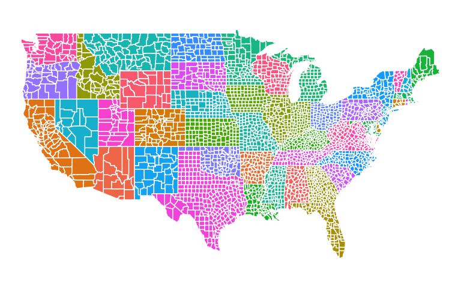
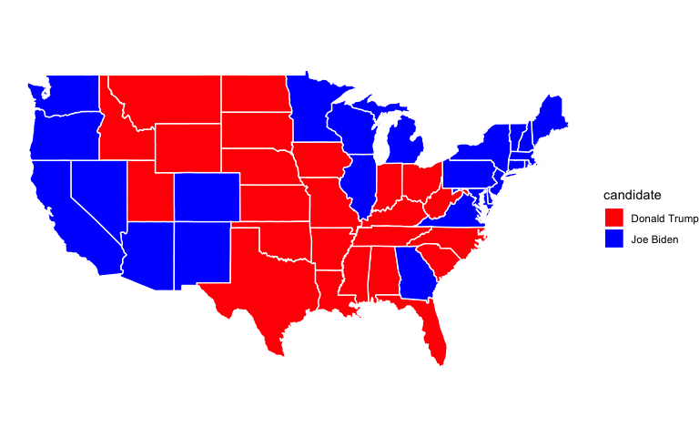

Exploratory Analysis of the 2020 Presidential Election
================
Alexander Sanchez

# Instructions and Expectations

Predicting voter behavior is complicated for many reasons despite the
tremendous effort in collecting, cleaning, analyzing, and understanding
many available datasets. As the midterm elections in the United States
is currently being held near the midpoint of the current president’s
four-year term of office, it is a good time for us to review the 2020
United States presidential election data! Despite that the 2016
presidential election came as a big surprise to many, Biden’s victory in
the 2020 presidential election has been widely predicted (e.g., see the
well-known Nate Silver in FiveThirtyEight).

# Data

We will start the analysis with two data sets. The first one is the
election data, which is drawn from here. The data contains county-level
election results.

The second dataset is the 2017 United States county-level census data,
which is available here.

The following code load in these two data sets: `election.raw` and
`census.`

# Exploratory Data Analysis

## Election Data

**Before we perform any data visualization, we will analyze the
election.raw dataset, including examining the data structure and
ensuring that it includes all states and a federal district.**

The following is the first few rows of the `election.raw` data.

    ## # A tibble: 6 × 5
    ##   state    county     candidate     party total_votes
    ##   <chr>    <chr>      <fct>         <fct>       <dbl>
    ## 1 Delaware Kent       Joe Biden     DEM         44552
    ## 2 Delaware Kent       Donald Trump  REP         41009
    ## 3 Delaware Kent       Jo Jorgensen  LIB          1044
    ## 4 Delaware Kent       Howie Hawkins GRN           420
    ## 5 Delaware New Castle Joe Biden     DEM        195034
    ## 6 Delaware New Castle Donald Trump  REP         88364

Checking dimensions of `election.raw` data set.

    ## [1] 32177     5

Checking for missing values in `election.raw` data set.

    ## [1] "There are no missing values"

Ensuring that it includes all states and a federal district

    ## [1] "Number of distinct states/districts: 51"

    ## [1] "Confirmed: Data contains all 50 states and federal district"

## Census data

The following is the first few rows of the `census` data. The column
names are all very self-explanatory:

    ## # A tibble: 6 × 37
    ##   CountyId State  County TotalPop   Men  Women Hispanic White Black Native Asian
    ##      <dbl> <chr>  <chr>     <dbl> <dbl>  <dbl>    <dbl> <dbl> <dbl>  <dbl> <dbl>
    ## 1     1001 Alaba… Autau…    55036 26899  28137      2.7  75.4  18.9    0.3   0.9
    ## 2     1003 Alaba… Baldw…   203360 99527 103833      4.4  83.1   9.5    0.8   0.7
    ## 3     1005 Alaba… Barbo…    26201 13976  12225      4.2  45.7  47.8    0.2   0.6
    ## 4     1007 Alaba… Bibb …    22580 12251  10329      2.4  74.6  22      0.4   0  
    ## 5     1009 Alaba… Bloun…    57667 28490  29177      9    87.4   1.5    0.3   0.1
    ## 6     1011 Alaba… Bullo…    10478  5616   4862      0.3  21.6  75.6    1     0.7
    ## # ℹ 26 more variables: Pacific <dbl>, VotingAgeCitizen <dbl>, Income <dbl>,
    ## #   IncomeErr <dbl>, IncomePerCap <dbl>, IncomePerCapErr <dbl>, Poverty <dbl>,
    ## #   ChildPoverty <dbl>, Professional <dbl>, Service <dbl>, Office <dbl>,
    ## #   Construction <dbl>, Production <dbl>, Drive <dbl>, Carpool <dbl>,
    ## #   Transit <dbl>, Walk <dbl>, OtherTransp <dbl>, WorkAtHome <dbl>,
    ## #   MeanCommute <dbl>, Employed <dbl>, PrivateWork <dbl>, PublicWork <dbl>,
    ## #   SelfEmployed <dbl>, FamilyWork <dbl>, Unemployment <dbl>

### Census Data Exploration and Comparison with Election Data

**Next, we will examine the structure and completeness of the census
dataset, identify any missing values, and compare the geographic
coverage between the census and election datasets to understand
potential data integration challenges.**

Checking dimensions of `census` data set.

    ## [1] 3220   37

Checking for missing values in `census` data set.

    ## [1] "There are missing values"

Which column has missing values?

    ## ChildPoverty 
    ##            1

There are more distinct counties in `election.raw` than in `census.`
Grouping them by state and county (some states have the same county
names), `census` has around 3220 counties, while `election.raw` has 4633
counties. Additionally, `census` has one more state than `election.raw`,
as `census` includes Puerto Rico. Examining both datasets reveals that
counties have different naming conventions despite referring to the same
geographic areas. For example, Alabama appears as ‘Autauga County’ in
`census` but ‘Autauga’ in `election.raw.` This naming inconsistency will
need to be resolved when merging the datasets.

# Data Wrangling

**3. (4 pts) Construct aggregated data sets from election.raw data:
i.e.,**

- Keep the county-level data as it is in election.raw.
- Create a state-level summary into a election.state.
- Create a federal-level summary into a election.total.

<!-- -->

    ## # A tibble: 6 × 3
    ##   candidate      state      total_votes
    ##   <fct>          <chr>            <dbl>
    ## 1 Alyson Kennedy Colorado           354
    ## 2 Alyson Kennedy Louisiana          536
    ## 3 Alyson Kennedy Minnesota          643
    ## 4 Alyson Kennedy Tennessee         2576
    ## 5 Alyson Kennedy Vermont            195
    ## 6 Alyson Kennedy Washington        2487

    ## # A tibble: 6 × 2
    ##   candidate      total_votes
    ##   <fct>                <dbl>
    ## 1 Alyson Kennedy        6791
    ## 2 Bill Hammons          6647
    ## 3 Blake Huber            409
    ## 4 Brian Carroll        25256
    ## 5 Brock Pierce         49552
    ## 6 Brooke Paige          1175

The 2020 presidential election featured 36 named candidates on ballots
across the United States, excluding “Write-ins” votes and “None of these
candidates” options. This analysis examines the vote distribution among
all candidates to understand the electoral landscape.

<!-- -->

The vote totals reveal a stark bifurcation in the American electoral
system. As shown in the visualization below, the two major party
candidates—Joe Biden (Democratic) and Donald Trump
(Republican)—dominated the election, receiving over 74 million votes
each. In contrast, all other candidates combined received significantly
fewer votes, with the highest third-party candidate earning under 2
million votes.

This dramatic difference in vote scale necessitates a two-panel
visualization approach. The upper panel displays the major party
candidates using a linear scale, clearly showing Biden’s victory margin
of approximately 7 million votes. The lower panel focuses on third-party
and independent candidates, using a logarithmic scale to facilitate
meaningful comparisons within this group.

The data illustrates how the American two-party system creates
substantial barriers for third-party candidates, regardless of their
public profile.

**5. (6 pts) Create data sets county.winner and state.winner by taking
the candidate with the highest proportion of votes in both county level
and state level. Hint: to create county.winner, start with election.raw,
group by state and county, compute total votes, and pct = votes/total as
the proportion of votes. Then choose the highest row using top_n
(variable state.winner is similar).**

# Visualization

The R package ggplot2 can be used to draw maps. Consider the following
code.

``` r
states <- map_data("state")

ggplot(data = states) + 
  geom_polygon(aes(x = long, y = lat, fill = region, group = group),
               color = "white") + 
  coord_fixed(1.3) +
  theme_void() + # removes 
  guides(fill="none")  # color legend is unnecessary and takes too long
```

<!-- -->

The variable states contain information to draw white polygons, and
fill-colors are determined by region.

**6. (4 pts) Use similar code to above to draw county-level map by
creating counties = map_data(“county”). Color by county.**

<!-- -->

<!-- -->

**8. (6 pts) Color the map of the state of California by the winning
candidate for each county.**

<!-- -->

<!-- -->

**9. (4 pts) (Open-ended) Create a visualization of your choice using
census data.** Many exit polls noted that demographics played a big role
in the election. Use this Washington Post article and this R graph
gallery for ideas and inspiration.

<!-- -->

<!-- -->

<!-- -->

<!-- -->

<!-- -->

<!-- -->
