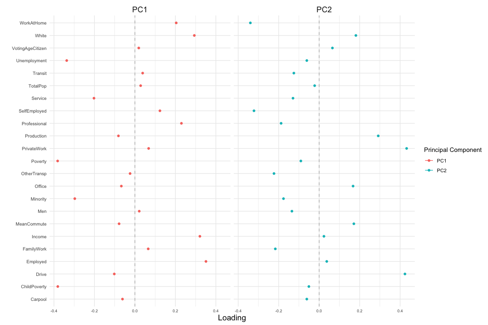
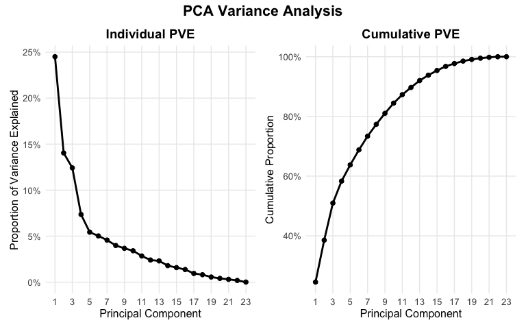
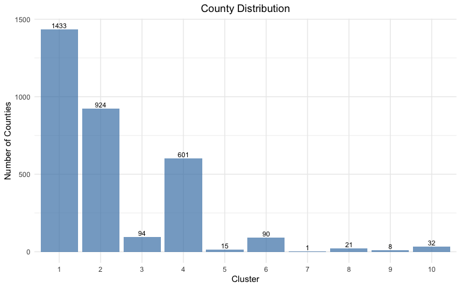
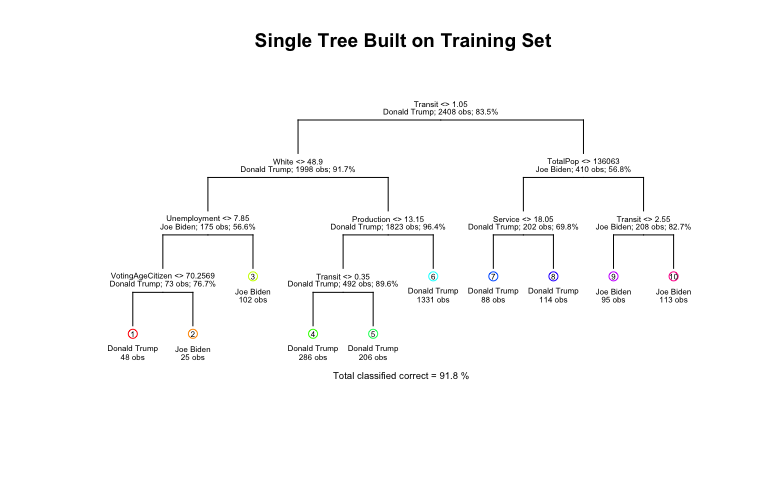
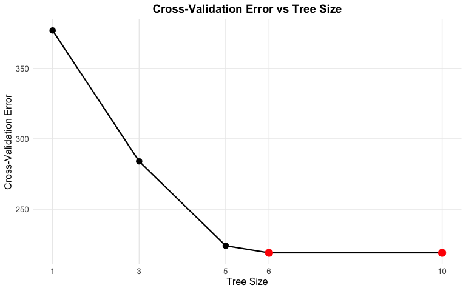
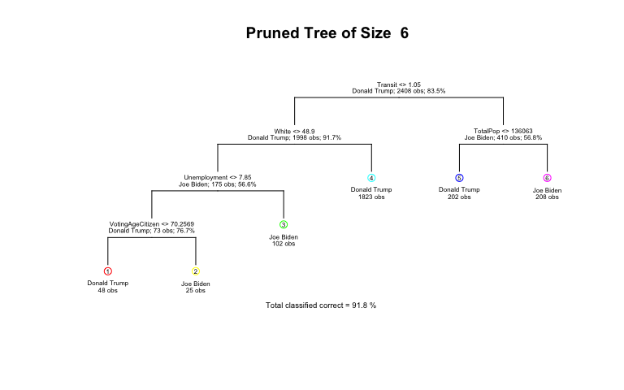
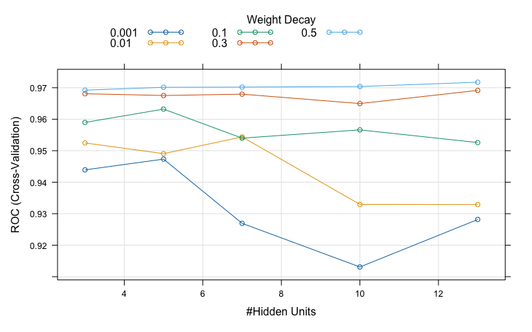
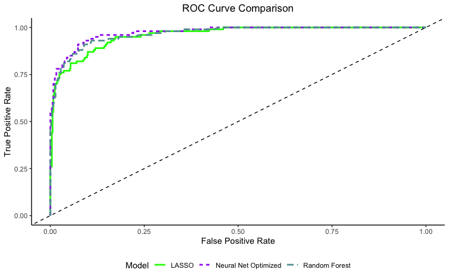

ML Analysis of the 2020 Presidential Election
================
Alexander Sanchez

# Instructions and Expectations

Predicting voter behavior is complicated for many reasons despite the
tremendous effort in collecting, cleaning, analyzing, and understanding
many available datasets. As the midterm elections in the United States
is currently being held near the midpoint of the current president’s
four-year term of office, it is a good time for us to review the 2020
United States presidential election data! Despite that the 2016
presidential election came as a big surprise to many, Biden’s victory in
the 2020 presidential election has been widely predicted (e.g., see the
well-known Nate Silver in FiveThirtyEight).

# Data

We will start the analysis with two data sets. The first one is the
election data, which is drawn from here. The data contains county-level
election results.

The second dataset is the 2017 United States county-level census data,
which is available here.

The following code load in these two data sets: `election.raw` and
`census.`

# Data Wrangling

**5. (6 pts) Create data sets county.winner and state.winner by taking
the candidate with the highest proportion of votes in both county level
and state level. Hint: to create county.winner, start with election.raw,
group by state and county, compute total votes, and pct = votes/total as
the proportion of votes. Then choose the highest row using top_n
(variable state.winner is similar).**

# Data Cleaning

We start by cleaning the county-level census data through several
transformations. Initially, we remove any rows with missing values using
`na.omit()` and `filter()`. Then, we convert three attributes (Men,
Employed, and VotingAgeCitizen) to percentages by dividing each by
TotalPop and multiplying by 100. The code creates a new Minority
attribute by combining Hispanic, Black, Native, Asian, and Pacific
populations and removes these original variables after creating the
Minority column using the `.keep = "unused" argument.` The Minority
column is then relocated to appear after the White column for better
organization.

The code removes several specified columns that are not needed for the
analysis: IncomeErr, IncomePerCap, IncomePerCapErr, Walk, PublicWork,
and Construction.

``` r
census.clean <- census %>%
  na.omit() %>%
  filter(if_any(everything(), ~ !is.na(.))) %>%
  mutate(
    Men = (Men/TotalPop) * 100,
    #Women = (Women/TotalPop) * 100
    Employed = (Employed/TotalPop) * 100,
    VotingAgeCitizen = (VotingAgeCitizen/TotalPop) * 100,
    Minority = Hispanic + Black + Native + Asian + Pacific
    ) %>%
  relocate(Minority, .after = White) %>%
  select(-c(Hispanic, Black, Native, Asian, Pacific, Women)) %>%
  select(-c(IncomeErr, IncomePerCap, IncomePerCapErr, Walk, PublicWork, Construction))

head(census.clean, 5)
```

    ## # A tibble: 5 × 26
    ##   CountyId State   County  TotalPop   Men White Minority VotingAgeCitizen Income
    ##      <dbl> <chr>   <chr>      <dbl> <dbl> <dbl>    <dbl>            <dbl>  <dbl>
    ## 1     1001 Alabama Autaug…    55036  48.9  75.4     22.8             74.5  55317
    ## 2     1003 Alabama Baldwi…   203360  48.9  83.1     15.4             76.4  52562
    ## 3     1005 Alabama Barbou…    26201  53.3  45.7     52.8             77.4  33368
    ## 4     1007 Alabama Bibb C…    22580  54.3  74.6     24.8             78.2  43404
    ## 5     1009 Alabama Blount…    57667  49.4  87.4     10.9             73.7  47412
    ## # ℹ 17 more variables: Poverty <dbl>, ChildPoverty <dbl>, Professional <dbl>,
    ## #   Service <dbl>, Office <dbl>, Production <dbl>, Drive <dbl>, Carpool <dbl>,
    ## #   Transit <dbl>, OtherTransp <dbl>, WorkAtHome <dbl>, MeanCommute <dbl>,
    ## #   Employed <dbl>, PrivateWork <dbl>, SelfEmployed <dbl>, FamilyWork <dbl>,
    ## #   Unemployment <dbl>

# Dimensionality reduction

After removing the State and County columns, the code creates a
two-column data frame called pc.county containing the first two
principal components (PC1 and PC2) from the PCA analysis of the cleaned
census data.

Regarding centering and scaling: The code uses both centering
`(center=TRUE)` and scaling `(scale=TRUE)` before running PCA, which is
appropriate because the variables in the census data have different
scales. For example, some variables are percentages, while others might
be raw counts or dollar values. Without scaling, variables with more
significant variances would dominate the principal components,
regardless of their importance.

``` r
pr.out.census <- prcomp(temp_census.clean, scale=TRUE, center = TRUE)
```

The three features with the largest absolute values of the first
principal component are:

Poverty, ChildPoverty, Employed

Several features have negative values in the first principal component,
including

Minority, Poverty, ChildPoverty, Service, Office, Production, Drive,
Carpool, OtherTransp, MeanCommute, Unemployment

<!-- -->

Notably, Poverty and ChildPoverty have negative loadings and large
magnitudes. Features with opposite signs in the principal component
typically indicate a negative correlation between them. This means that
as one feature increases, the other tends to decrease. In this case, the
negative correlation suggests that counties with higher values in these
socioeconomic indicators tend to have lower values in other related
features.

For instance, counties with high poverty rates might be associated with
lower income levels, fewer job opportunities, and different commuting
patterns. The opposite signs in the first principal component capture
this underlying relationship in the data, showing how different
socioeconomic and demographic variables are interconnected.

## Determine the number of minimum number of PCs needed to capture 90% of the variance for the analysis

The code calculates the proportion of variance explained (PVE) for each
principal component by: 1. Extracting the standard deviations from the
principal component analysis 2. Calculating the variance by squaring the
standard deviations 3. Computing the proportion of variance by dividing
each component’s variance by the total variance

``` r
x <- pr.out.census$sdev

pr.var <- x^2

pve <- pr.var/sum(pr.var)
```

Computing `min(which(cumsum(pve) >= .9))`, we need about 13 PCs in order
to explain 90% of the total variation in the data. Thus, we need to
retain the first 13 components to explain at least 90% of the
variability in the original data.

The cumulative proportion of variance plot visually demonstrates how the
explained variance accumulates as more principal components are
included, allowing us to see the incremental contribution of each
additional component to the total variance explained.

<!-- -->

# Clustering

### Centering and Scaling

Same approach as dimensionality reduction.

``` r
scar <- scale(census.clean[,c(-1:-3)], center=TRUE, scale=TRUE)
census.clean.dist <- dist(scar)
set.seed(10)
census.clean.hclust <- hclust(census.clean.dist)
```

### First Clustering (Original Features):

When performing hierarchical clustering using the scaled original
features with complete linkage and cutting the tree into 10 clusters,
the distribution of observations across clusters is quite uneven.
Cluster 1 contains the most observations, with 2924 counties, while
several other clusters have very few counties. For instance, clusters 6
and 10 have only 1 and 4 counties, respectively, indicating that the
clustering algorithm identified a few very distinct groups among the
counties.
<!-- -->

### Second Clustering (First Two Principal Components):

The cluster distribution changes significantly after re-running the
hierarchical clustering using the first two principal components from
pc.county. Cluster 1 contains 1433 counties, cluster 2 has 924 counties,
and Cluster 4 has 601 counties. The remaining clusters have fewer
counties, but the distribution differs from the first clustering.
<!-- -->

What can we take out of this

- Both clustering approaches result in highly imbalanced cluster sizes,
  suggesting some very distinct groups of counties.
- The uneven cluster sizes in both methods suggest that a few very
  distinct county groups stand out from the majority, which could
  represent counties with unique demographic or economic
  characteristics.

# Classification

We exclude the predictor party from election.cl because the
classification task aims to predict a county’s winner using census
information. Including party as a predictor would create data leakage,
as it directly informs us about the candidate’s party affiliation rather
than the demographic or socioeconomic factors of the county.

The party variable is tied to the outcome (the winner), and its
inclusion would undermine the model’s ability to generalize by basing
predictions on the relationship between party and candidate rather than
the census data. We remove the party variable from the dataset to ensure
the model learns from relevant predictors.

``` r
# we move all state and county names into lower-case
tmpwinner <- county.winner %>% ungroup %>%
  mutate_at(vars(state, county), tolower)

# we move all state and county names into lower-case
# we further remove suffixes of "county" and "parish"
tmpcensus <- census.clean %>% mutate_at(vars(State, County), tolower) %>%
  mutate(County = gsub(" county|  parish", "", County))

# we join the two datasets
election.cl <- tmpwinner %>%
  left_join(tmpcensus, by = c("state"="State", "county"="County")) %>%
  na.omit

# drop levels of county winners if you haven't done so in previous parts
election.cl$candidate <- droplevels(election.cl$candidate)

## save meta information
election.meta <- election.cl %>% select(c(county, party, CountyId, state, total_votes, pct, total))

## save predictors and class labels
election.cl = election.cl %>% select(-c(county, party, CountyId, state, total_votes, pct, total))
```

## Train/Test Split

Using the following code, partition data into 80% training and 20%
testing:

``` r
set.seed(10)
n <- nrow(election.cl)
idx.tr <- sample.int(n, 0.8*n)
election.tr <- election.cl[idx.tr, ]
election.te <- election.cl[-idx.tr, ]
```

Use the following code to define 10 cross-validation folds:

Using the following error rate function. And the object records is used
to record the classification performance of each method in the
subsequent problems.

**15. Decision tree: (2 pts) train a decision tree by cv.tree().** (2
pts) Prune tree to minimize misclassification error. Be sure to use the
folds from above for cross-validation. (2 pts) Visualize the trees
before and after pruning. (1 pts) Save training and test errors to
records object. (2 pts) Interpret and discuss the results of the
decision tree analysis. (2 pts) Use this plot to tell a story about
voting behavior.

Decision Tree purity

<!-- -->

From our function `cv.tree()`, the best size is 6.

<!-- -->

<!-- -->

**Both trees have Transit first followed by White and Women. Before
pruning, White was right below Women, but in after pruning, White is at
the very bottom of Women. Minority is still at the same place. In after
pruning, Professional is not in the White split, but Professional is
still in the Women split. Women is absent in the White split. Men is
also absent in the White split.**

**It seems White was a big contributing factor if you were going to vote
for Trump, while it seems Women was a big contributing factor if you
were going to vote for Biden.**

    ##               
    ## pred.test.tree Donald Trump Joe Biden
    ##   Donald Trump          478        40
    ##   Joe Biden              24        60

**16. (2 pts) Run a logistic regression to predict the winning candidate
in each county.** (1 pts) Save training and test errors to records
variable. (1 pts) What are the significant variables? (1 pts) Are they
consistent with what you saw in decision tree analysis? (2 pts)
Interpret the meaning of a couple of the significant coefficients in
terms of a unit change in the variables.

For interpretable machine learning

Using traditional $p < 0.05$ criteria, the significant variables are
TotalPop, White, VotingAgeCitizen, Professional, Service, Office,
Production, Drive, Carpool, Employed, PrivateWork, Unemployment. White
is included, but Women and Minority are not among the top 5. It does
deviate from the Decision Tree analysis. However, with our large sample
size (n = 2,408), nearly all non-zero coefficients will appear
statistically significant, making this criterion less meaningful for
practical variable selection.

    ## VotingAgeCitizen     Professional          Service            Drive 
    ##           1.2270           1.3484           1.4201           0.8182 
    ##         Employed       FamilyWork     Unemployment 
    ##           1.3268           0.5958           1.3098

Below are the significant variables:

    ## Unemployment     Employed Professional      Service   FamilyWork 
    ##       0.2699       0.2827       0.2989       0.3507       0.5178

If we were to increase VotingAgeCitizen by one unit, holding the rest
fixed, then applying the same logic to Unemployment, Unemployment,
Employed, Professional, and Service, we would get a percent in the odds:

    ## VotingAgeCitizen     Unemployment         Employed     Professional 
    ##            22.70            30.98            32.68            34.84 
    ##          Service 
    ##            42.01

**17. You may notice that you get a warning glm.fit: fitted
probabilities numerically 0 or 1 occurred.** As we discussed in class,
this is an indication that we have perfect separation (some linear
combination of variables perfectly predicts the winner). This is usually
a sign that we are overfitting. One way to control overfitting in
logistic regression is through regularization.

(3 pts) Use the cv.glmnet function from the glmnet library to run a
10-fold cross validation and select the best regularization parameter
for the logistic regression with LASSO penalty. Set lambda = seq(1, 50)
\* 1e-4 in cv.glmnet() function to set pre-defined candidate values for
the tuning parameter λ.

(1 pts) What is the optimal value of λ in cross validation? (1 pts) What
are the non-zero coefficients in the LASSO regression for the optimal
value of λ? (1 pts) How do they compare to the unpenalized logistic
regression? (1 pts) Comment on the comparison. (1 pts) Save training and
test errors to the records variable.

The optimal value of $\lambda$ in cross validation is 0.0011.

Below are the non-zero coefficients in the LASSO regression for the
optimal value of λ:

    ##      (Intercept)         TotalPop              Men            White 
    ##       -3.213e+01        1.471e-06        2.188e-02       -1.222e-01 
    ## VotingAgeCitizen          Poverty     Professional          Service 
    ##        1.916e-01        5.175e-02        2.409e-01        2.821e-01 
    ##           Office       Production            Drive          Carpool 
    ##        7.449e-02        1.184e-01       -1.416e-01       -1.151e-01 
    ##          Transit      OtherTransp      MeanCommute         Employed 
    ##        6.278e-02        2.807e-02        2.594e-02        2.465e-01 
    ##      PrivateWork     SelfEmployed       FamilyWork     Unemployment 
    ##        7.233e-02       -2.918e-02       -4.376e-01        2.370e-01

Unpenalized logistic regression: When taking their absolute values,
Women and Income had low coefficients compared to the rest of the
variables. Excluding these two, the other variables were within range of
each other.

LASSO regression: Minority, Income, WorkAtHome, and MeanCommute had zero
coefficients.

It does seem Income is not an important metric. White has been
consistently shown as being an important variable.

**18. (6 pts) Compute ROC curves for the decision tree, logistic
regression and LASSO logistic regression using predictions on the test
data.** Display them on the same plot. (2 pts) Based on your
classification results, discuss the pros and cons of the various
methods. (2 pts) Are the different classifiers more appropriate for
answering different kinds of questions about the election?

<!-- -->

**Answer:**

**Answer: **

# Taking it further

This part will be worth up to a 20% of your final project grade!

**19. (9 pts) Explore additional classification methods.** Consider
applying additional two classification methods from KNN, LDA, QDA, SVM,
random forest, boosting, neural networks etc. (You may research and use
methods beyond those covered in this course). How do these compare to
the tree method, logistic regression, and the lasso logistic regression?

### Random Forest

### Neural Net

    ## Loading required package: foreach

    ## 
    ## Attaching package: 'foreach'

    ## The following objects are masked from 'package:purrr':
    ## 
    ##     accumulate, when

    ## Loading required package: iterators

    ## Aggregating results
    ## Selecting tuning parameters
    ## Fitting size = 13, decay = 0.5 on full training set

    ## Warning: Setting row names on a tibble is deprecated.

<!-- -->

<!-- -->

<!-- -->

**Answer:**

**Plotting the ROC Curve for all the methods, we see that our CV
Decision Tree performs the worst, then Random Forest. After that, it’s a
matter of personal preference. Random Forest does outperform CV Decision
Tree throughout the ROC Curve. In my opinion Decision Tree and Random
Forest would not be suitable for our problem since we already narrowed
it down to two candidates. I still think LASSO Logistic Regression is
the most optimal, followed by our regular Logistic Regression.**
