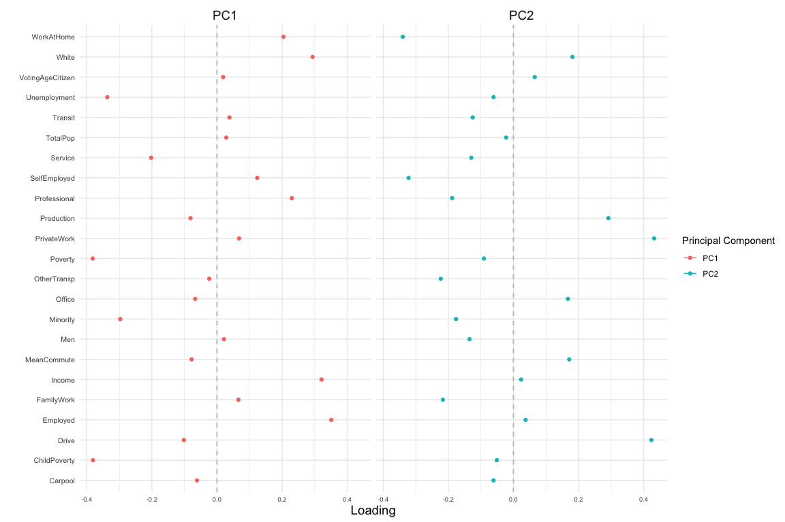
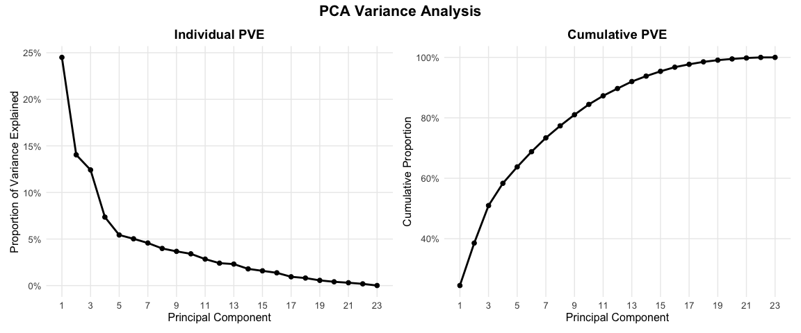
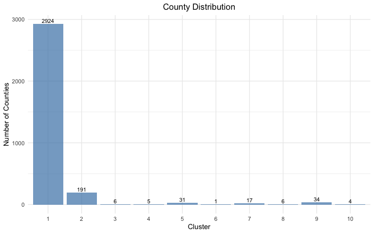
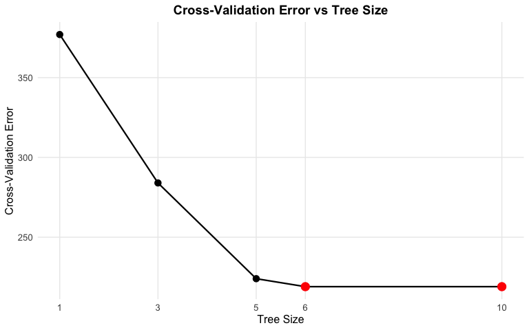
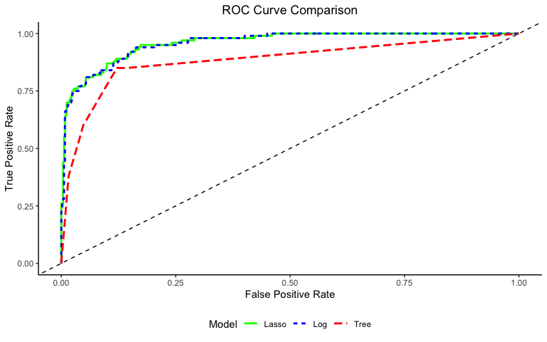
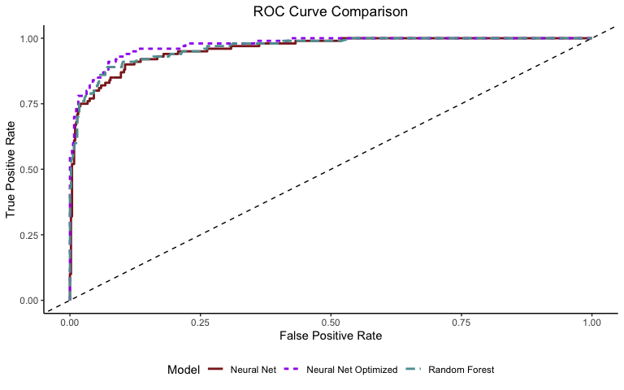

ML Analysis of the 2020 Presidential Election
================
Alexander Sanchez

# Instructions and Expectations

Predicting voter behavior is complicated for many reasons despite the
tremendous effort in collecting, cleaning, analyzing, and understanding
many available datasets. As the midterm elections in the United States
is currently being held near the midpoint of the current president’s
four-year term of office, it is a good time for us to review the 2020
United States presidential election data! Despite that the 2016
presidential election came as a big surprise to many, Biden’s victory in
the 2020 presidential election has been widely predicted (e.g., see the
well-known Nate Silver in FiveThirtyEight).

# Data

We will start the analysis with two data sets. The first one is the
election data, which is drawn from here. The data contains county-level
election results.

The second dataset is the 2017 United States county-level census data,
which is available here.

The following code load in these two data sets: `election.raw` and
`census.`

# Data Wrangling

**5. (6 pts) Create data sets county.winner and state.winner by taking
the candidate with the highest proportion of votes in both county level
and state level. Hint: to create county.winner, start with election.raw,
group by state and county, compute total votes, and pct = votes/total as
the proportion of votes. Then choose the highest row using top_n
(variable state.winner is similar).**

# Data Cleaning

We start by cleaning the county-level census data through several
transformations. Initially, we remove any rows with missing values using
`na.omit()` and `filter()`. Then, we convert three attributes (Men,
Employed, and VotingAgeCitizen) to percentages by dividing each by
TotalPop and multiplying by 100. The code creates a new Minority
attribute by combining Hispanic, Black, Native, Asian, and Pacific
populations and removes these original variables after creating the
Minority column using the `.keep = "unused" argument.` The Minority
column is then relocated to appear after the White column for better
organization.

The code removes several specified columns that are not needed for the
analysis: IncomeErr, IncomePerCap, IncomePerCapErr, Walk, PublicWork,
and Construction.

``` r
census.clean <- census %>%
  na.omit() %>%
  filter(if_any(everything(), ~ !is.na(.))) %>%
  mutate(
    Men = (Men/TotalPop) * 100,
    #Women = (Women/TotalPop) * 100
    Employed = (Employed/TotalPop) * 100,
    VotingAgeCitizen = (VotingAgeCitizen/TotalPop) * 100,
    Minority = Hispanic + Black + Native + Asian + Pacific
    ) %>%
  relocate(Minority, .after = White) %>%
  select(-c(Hispanic, Black, Native, Asian, Pacific, Women)) %>%
  select(-c(IncomeErr, IncomePerCap, IncomePerCapErr, Walk, PublicWork, Construction))

head(census.clean, 5)
```

    ## # A tibble: 5 × 26
    ##   CountyId State   County  TotalPop   Men White Minority VotingAgeCitizen Income
    ##      <dbl> <chr>   <chr>      <dbl> <dbl> <dbl>    <dbl>            <dbl>  <dbl>
    ## 1     1001 Alabama Autaug…    55036  48.9  75.4     22.8             74.5  55317
    ## 2     1003 Alabama Baldwi…   203360  48.9  83.1     15.4             76.4  52562
    ## 3     1005 Alabama Barbou…    26201  53.3  45.7     52.8             77.4  33368
    ## 4     1007 Alabama Bibb C…    22580  54.3  74.6     24.8             78.2  43404
    ## 5     1009 Alabama Blount…    57667  49.4  87.4     10.9             73.7  47412
    ## # ℹ 17 more variables: Poverty <dbl>, ChildPoverty <dbl>, Professional <dbl>,
    ## #   Service <dbl>, Office <dbl>, Production <dbl>, Drive <dbl>, Carpool <dbl>,
    ## #   Transit <dbl>, OtherTransp <dbl>, WorkAtHome <dbl>, MeanCommute <dbl>,
    ## #   Employed <dbl>, PrivateWork <dbl>, SelfEmployed <dbl>, FamilyWork <dbl>,
    ## #   Unemployment <dbl>

# Dimensionality reduction

After removing the State and County columns, the code creates a
two-column data frame called pc.county containing the first two
principal components (PC1 and PC2) from the PCA analysis of the cleaned
census data.

Regarding centering and scaling: The code uses both centering
`(center=TRUE)` and scaling `(scale=TRUE)` before running PCA, which is
appropriate because the variables in the census data have different
scales. For example, some variables are percentages, while others might
be raw counts or dollar values. Without scaling, variables with more
significant variances would dominate the principal components,
regardless of their importance.

``` r
pr.out.census <- prcomp(temp_census.clean, scale=TRUE, center = TRUE)
```

The three features with the largest absolute values of the first
principal component are:

Poverty, ChildPoverty, Employed

<!-- -->

### PC1 Loading Analysis

Looking at the PC1 loadings, several key pairs of features have opposite
signs:

**Key opposite sign pairs:**

- **Poverty/Child Poverty (negative) vs. Income (positive)**: These
  opposite signs indicate that counties with higher poverty rates tend
  to have lower incomes, showing a strong negative correlation between
  economic hardship and affluence.

- **Unemployment (negative) vs. Employed (positive)**: The opposite
  loadings indicate that counties with high unemployment rates tend to
  have low employment rates, which is expected given that these are
  complementary measures.

- **Minority (negative) vs White (positive)**: This indicates that
  counties with higher minority populations tend to have lower white
  populations, reflecting demographic composition patterns.

- **Service (negative) vs Professional/Office (positive)**: Counties
  with more service sector employment tend to have fewer professional
  and office workers, suggesting different economic structures.

These opposite signs in PC1 indicate that the first principal component
captures a socioeconomic divide, where affluent counties (characterized
by high income, employment, professional work, and a white population)
contrast with economically disadvantaged counties (characterized by high
poverty, unemployment, service work, and minority populations). The
negative correlations between these feature pairs indicate they tend to
move in opposite directions across counties.

### PC2 Loading Analysis

Looking at the PC2 loadings, several key pairs of features have opposite
signs:

**Key opposite sign pairs:**

- **Income (negative) vs. White (positive)**: This suggests that in
  PC2’s dimension, areas with higher incomes tend to have lower white
  populations, indicating PC2 may capture urban diversity patterns where
  diverse, higher-income areas contrast with predominantly white areas.

- **Transit/OtherTransp (negative) vs. Drive (positive)**: Counties with
  more public transit and alternative transportation have fewer people
  driving to work, reflecting urban versus suburban/rural transportation
  patterns.

- **MeanCommute (negative) vs. WorkAtHome (positive)**: Areas with
  longer average commutes tend to have fewer people working from home,
  suggesting PC2 captures commuting versus remote work patterns.

- **Service (negative) vs. Professional/Office (positive)**: This
  indicates different employment structures, where service-oriented
  economies contrast with professional or office-based economies.

PC2 captures an urban-suburban/rural divide where dense,
transit-oriented areas with diverse populations and longer commutes
contrast with regions characterized by car dependency, remote work, and
professional employment. The opposite signs reveal that PC2 identifies
counties along a spectrum of urbanization and work/transportation
patterns.

## Determine the number of minimum number of PCs needed to capture 90% of the variance for the analysis

The code calculates the proportion of variance explained (PVE) for each
principal component by: 1. Extracting the standard deviations from the
principal component analysis 2. Calculating the variance by squaring the
standard deviations 3. Computing the proportion of variance by dividing
each component’s variance by the total variance

``` r
x <- pr.out.census$sdev

pr.var <- x^2

pve <- pr.var/sum(pr.var)
```

Computing `min(which(cumsum(pve) >= .9))`, we need about 13 PCs in order
to explain 90% of the total variation in the data. Thus, we need to
retain the first 13 components to explain at least 90% of the
variability in the original data.

The cumulative proportion of variance plot visually demonstrates how the
explained variance accumulates as more principal components are
included, allowing us to see the incremental contribution of each
additional component to the total variance explained.

<!-- -->

### PCA Justification and Interpretation

**1. Is focusing on PC1 and PC2 justified?**

- PC1 and PC2 together account for roughly 38-40% of the total variance,
  which is low compared to the usual 70-80% threshold for good
  representation. However, the sharp elbow after PC2 in the individual
  PVE plot and the significant drop from about 14% to 7% suggest these
  two components capture the most meaningful patterns in the data.

**2. What overall patterns do PC1 and PC2 capture?**

- PC1 (~25% variance) reflects a socioeconomic divide where affluent
  counties (high income, employment, professional work, white
  population) contrast with disadvantaged counties (high poverty,
  unemployment, minority populations). PC2 (~13-14% variance) indicates
  an urban-suburban/rural divide characterized by transportation
  patterns (transit vs. driving), work arrangements (commuting
  vs. remote), and population density differences.

# Clustering

### Centering and Scaling

Same approach as dimensionality reduction.

``` r
scar <- scale(census.clean[,c(-1:-3)], center=TRUE, scale=TRUE)
census.clean.dist <- dist(scar)
set.seed(10)
census.clean.hclust <- hclust(census.clean.dist)
```

### First Clustering (Original Features):

When performing hierarchical clustering using the scaled original
features with complete linkage and cutting the tree into 10 clusters,
the distribution of observations across clusters is quite uneven.
Cluster 1 contains the most observations, with 2924 counties, while
several other clusters have very few counties. For instance, clusters 6
and 10 have only 1 and 4 counties, respectively, indicating that the
clustering algorithm identified a few very distinct groups among the
counties.

<!-- -->

### Second Clustering (First Two Principal Components):

The cluster distribution changes significantly after re-running the
hierarchical clustering using the first two principal components from
pc.county. Cluster 1 contains 1433 counties, cluster 2 has 924 counties,
and Cluster 4 has 601 counties. The remaining clusters have fewer
counties, but the distribution differs from the first clustering.

<!-- -->

What can we take out of this

- Both clustering approaches result in highly imbalanced cluster sizes,
  suggesting some very distinct groups of counties.
- The uneven cluster sizes in both methods suggest that a few very
  distinct county groups stand out from the majority, which could
  represent counties with unique demographic or economic
  characteristics.

# Classification

We exclude the predictor party from election.cl because the
classification task aims to predict a county’s winner using census
information. Including party as a predictor would create data leakage,
as it directly informs us about the candidate’s party affiliation rather
than the demographic or socioeconomic factors of the county.

The party variable is tied to the outcome (the winner), and its
inclusion would undermine the model’s ability to generalize by basing
predictions on the relationship between party and candidate rather than
the census data. We remove the party variable from the dataset to ensure
the model learns from relevant predictors.

``` r
# we move all state and county names into lower-case
tmpwinner <- county.winner %>% ungroup %>%
  mutate_at(vars(state, county), tolower)

# we move all state and county names into lower-case
# we further remove suffixes of "county" and "parish"
tmpcensus <- census.clean %>% mutate_at(vars(State, County), tolower) %>%
  mutate(County = gsub(" county|  parish", "", County))

# we join the two datasets
election.cl <- tmpwinner %>%
  left_join(tmpcensus, by = c("state"="State", "county"="County")) %>%
  na.omit

# drop levels of county winners if you haven't done so in previous parts
election.cl$candidate <- droplevels(election.cl$candidate)

## save meta information
election.meta <- election.cl %>% select(c(county, party, CountyId, state, total_votes, pct, total))

## save predictors and class labels
election.cl = election.cl %>% select(-c(county, party, CountyId, state, total_votes, pct, total))
```

## Train/Test Split

Using the following code, partition data into 80% training and 20%
testing:

``` r
set.seed(10)
n <- nrow(election.cl)
idx.tr <- sample.int(n, 0.8*n)
election.tr <- election.cl[idx.tr, ]
election.te <- election.cl[-idx.tr, ]
```

Using the following code to define 10 cross-validation folds:

``` r
set.seed(10)
nfold <- 10
folds <- sample(cut(1:nrow(election.tr), breaks=nfold, labels=FALSE))
```

Using the following error rate function. And the object records is used
to record the classification performance of each method in the
subsequent problems.

``` r
calc_error_rate = function(predicted.value, true.value){
  return(mean(true.value!=predicted.value))
}
records = matrix(NA, nrow=6, ncol=2)
colnames(records) = c("train.error","test.error")
rownames(records) = c("Decision Tree","Logistic Regression","Lasso Logistic Regression","Random Forest","Neural Network", "Neural Network Optimized")
```

## Decision Tree Analysis

In this analysis, we’ll build a decision tree classifier to predict
county-level voting patterns in the 2020 election. Decision trees are
especially useful for understanding complex data relationships because
they create interpretable rules that reflect human decision-making
processes. We’ll begin by training a full decision tree on our training
data, then use cross-validation to find the best tree size that
minimizes misclassification error while preventing overfitting. After
pruning the tree to this optimal size, we’ll visualize both the original
and pruned trees to see how the model makes predictions. Finally, we’ll
evaluate the model’s performance on both training and test sets and
interpret the decision rules to gain insights into American voting
behavior and the factors influencing political preferences at the county
level.

### Building the Initial Tree

First, we train a decision tree using all available predictors:

<!-- -->

### Cross-Validation and Pruning

We use cross-validation to find the optimal tree size that minimizes
misclassification error:

Cross-validation suggests the optimal tree size is r best_size_min
nodes.

<!-- -->

### Pruned Tree

We prune the tree to the optimal size and visualize the result:

<!-- -->

## Decision Tree Analysis: A Story of American Voting Patterns

This decision tree provides fascinating insights into county-level
voting patterns in the 2020 election, offering a clear overview of the
different types of American communities.

### The Primary Divide: Transit Usage

The tree’s **root split on Transit \> 1.05%** immediately divides
America into two distinct worlds.

- **Left branch (Transit ≤ 1.05%)**: Rural and suburban areas in America
  with limited public transit.
- **Right branch (Transit \> 1.05%)**: More urban areas with public
  transit.

This indicates that **urbanization level** (measured by transit usage)
was the most predictive factor for voting behavior.

### Rural/Suburban America Story (Left Branch)

In low-transit areas, the tree tells a nuanced story:

**1. The “White Rural” Pattern (Node 4)**

- Counties with **more than 48.9% White population** → **Donald Trump
  (1,823 counties, 91.7% accuracy)**
- This depicts traditional rural America - mostly white, low transit
  usage.
- Massive Trump stronghold, the largest single group.

**2. The “Diverse Rural” Pattern**

- Counties with **48.9% or less White population** further divided by
  unemployment:
  - **High unemployment (\>7.85%)** → **Joe Biden (Node 3, 102
    counties)**
  - **Low unemployment (≤7.85%)** → Further subdivisions on voting-age
    citizenship

**3. The “Mixed Communities” Pattern (Nodes 1 & 2)**

- In various rural areas with low unemployment, **voting-age
  citizenship** becomes crucial.
- **Lower citizenship rates (≤70.3%)** → **Trump (Node 1, 48 counties)**
- **Higher citizenship rates (\>70.3%)** → **Biden (Node 2, 25
  counties)**

### Urban America Story (Right Branch)

In higher-transit areas, the pattern is simpler but revealing:

- **Small-medium urban areas (population ≤136K)** → **Trump (Node 5, 202
  counties)**
- **Large urban areas (population \>136K)** → **Biden (Node 6, 208
  counties)**

### Key Voting Behavior Insights

1.  **Geographic Polarization**: The main divide is between urban and
    rural areas, as indicated by transit usage.

2.  **Racial Demographics Matter**: In rural areas, racial makeup is the
    second most important factor.

3.  **Economic hardship influences voting for Democrats**: High
    unemployment in diverse rural areas favors Biden.

4.  **Urban Size Threshold**: There is a critical population size
    (~136K) at which urban areas switch from Republican to Democratic.

5.  **Immigration Patterns**: In mixed rural communities, areas with
    more recent immigrants (those with lower voting-age citizenship)
    tend to support Trump, possibly reflecting concerns about economic
    competition.

### The Broader Narrative

This tree captures the **“Two Americas”** phenomenon:

- **Rural and small-town America**: Mainly Republican, with exceptions
  in economically distressed and diverse regions.
- **Urban America**: Tends to be Democratic in major cities, but smaller
  urban areas can still lean Republican
- **The complexity of modern politics**: Even within these broad
  categories, factors like economic conditions, demographics, and
  immigration patterns add important nuances.

<!-- -->

    ##               
    ## pred.test.tree Donald Trump Joe Biden
    ##   Donald Trump          478        40
    ##   Joe Biden              24        60

## Logistic Regression Analysis

We’ll now develop a logistic regression model to predict county-level
voting outcomes and compare its insights with our decision tree
analysis. Unlike decision trees that generate interpretable rules
through splits, logistic regression estimates the outcome’s probability
by modeling the relationship between predictors and the log-odds of
voting for a specific candidate. This method allows us to measure the
individual impact of each variable while accounting for all others.

Our analysis will involve fitting the logistic regression model to our
training data, evaluating its performance on both training and test
sets, and identifying which variables significantly influence voting
patterns. We’ll examine both statistical significance (p-values) and
practical significance (odds ratios) to understand which factors have
meaningful real-world impact. Finally, we’ll compare these results with
our decision tree findings to see whether different modeling approaches
reveal consistent patterns in American voting behavior or highlight
different aspects of the electoral landscape.

**Coefficient Interpretation:**

    ## VotingAgeCitizen     Unemployment         Employed     Professional 
    ##            22.70            30.98            32.68            34.84 
    ##          Service 
    ##            42.01

Let’s focus on VotingAgeCitizen as a specific example. A 1 percentage
point increase in VotingAgeCitizen is linked to a 22.70% rise in the
odds of a county voting for Joe Biden, holding all other variables
constant. This indicates that counties with higher proportions of
voting-age citizens tend to favor Democratic candidates.

## Significant Variables

#### P-Value Approach (p \< 0.05)

Using traditional $p < 0.05$ criteria, the significant variables are
TotalPop, White, VotingAgeCitizen, Professional, Service, Office,
Production, Drive, Carpool, Employed, PrivateWork, Unemployment.
Something we need to consider is our large sample size (n = 2,408). With
our large sample size (n = 2,408), nearly all non-zero coefficients will
appear statistically significant, making this criterion less meaningful
for practical variable selection.

### Odds Ratios (\>20% change in odds)

**Why Odds Ratios Over P-Values**: While p-values indicate whether an
effect is statistically significant, they do not show the **practical
significance** or **magnitude** of the effect. In large datasets like
ours, even tiny, practically meaningless effects become statistically
significant. Odds ratios display the **size** of the effect, helping us
determine which variables have meaningful real-world impacts on voting
behavior.

**Understanding Odds Ratios:** An odds ratio indicates the
multiplicative change in odds with a one-unit increase in the predictor.
For example, VotingAgeCitizen = 1.2270 means that for each 1 percentage
point rise in voting-age citizens, the odds of voting for Biden increase
by 22.70%, assuming all other variables stay the same.

    ## VotingAgeCitizen     Professional          Service            Drive 
    ##           1.2270           1.3484           1.4201           0.8182 
    ##         Employed       FamilyWork     Unemployment 
    ##           1.3268           0.5958           1.3098

**Important Limitations**: These interpretations assume a ceteris
paribus (all other variables held constant) approach, which rarely
occurs in real life. Additionally, logistic regression assumes linear
relationships between predictors and the log-odds and that observations
are independent. The model does not account for complex interactions
between variables that might exist in actual voting behavior.

### Comparison with Decision Tree Analysis

**Similarities:** - Both methods identify **White, VotingAgeCitizen, and
Unemployment** as key predictors. - Both highlight the significance of
**demographic composition** and **economic conditions** in voting
behavior. - Both demonstrate that **higher unemployment** generally
benefits Democratic candidates.

**Key Differences:** - **Geographic vs. Occupational Focus**: The
decision tree emphasizes **Transit** (urbanization) as the main split,
while logistic regression highlights **occupational categories**
(Professional, Service) as the key predictors. - **Variable Selection**:
Decision tree uses **TotalPop** for urban classification, but logistic
regression shows **Service** and **Professional** occupations as more
influential. - **Interpretability**: The decision tree provides clear
geographic narratives (urban vs. rural), while logistic regression
uncovers more detailed occupational and demographic effects.

**General Analysis:** Both methods agree on the crucial role of
demographic and economic factors in voting behavior, but they highlight
different aspects. The decision tree’s geographic focus matches the “Two
Americas” narrative, while logistic regression’s focus on occupational
factors suggests that **job type** and **economic role** might be even
more predictive than simple urban-rural geography. This complementary
view broadens our understanding of American election patterns.

**17. You may notice that you get a warning glm.fit: fitted
probabilities numerically 0 or 1 occurred.** As we discussed in class,
this is an indication that we have perfect separation (some linear
combination of variables perfectly predicts the winner). This is usually
a sign that we are overfitting. One way to control overfitting in
logistic regression is through regularization.

(3 pts) Use the cv.glmnet function from the glmnet library to run a
10-fold cross validation and select the best regularization parameter
for the logistic regression with LASSO penalty. Set lambda = seq(1, 50)
\* 1e-4 in cv.glmnet() function to set pre-defined candidate values for
the tuning parameter λ.

(1 pts) What is the optimal value of λ in cross validation? (1 pts) What
are the non-zero coefficients in the LASSO regression for the optimal
value of λ? (1 pts) How do they compare to the unpenalized logistic
regression? (1 pts) Comment on the comparison. (1 pts) Save training and
test errors to the records variable.

The optimal value of $\lambda$ in cross validation is 0.0011.

Below are the non-zero coefficients in the LASSO regression for the
optimal value of λ:

    ##      (Intercept)         TotalPop              Men            White 
    ##       -3.213e+01        1.471e-06        2.188e-02       -1.222e-01 
    ## VotingAgeCitizen          Poverty     Professional          Service 
    ##        1.916e-01        5.175e-02        2.409e-01        2.821e-01 
    ##           Office       Production            Drive          Carpool 
    ##        7.449e-02        1.184e-01       -1.416e-01       -1.151e-01 
    ##          Transit      OtherTransp      MeanCommute         Employed 
    ##        6.278e-02        2.807e-02        2.594e-02        2.465e-01 
    ##      PrivateWork     SelfEmployed       FamilyWork     Unemployment 
    ##        7.233e-02       -2.918e-02       -4.376e-01        2.370e-01

Unpenalized logistic regression: When taking their absolute values,
Women and Income had low coefficients compared to the rest of the
variables. Excluding these two, the other variables were within range of
each other.

LASSO regression: Minority, Income, WorkAtHome, and MeanCommute had zero
coefficients.

It does seem Income is not an important metric. White has been
consistently shown as being an important variable.

**18. (6 pts) Compute ROC curves for the decision tree, logistic
regression and LASSO logistic regression using predictions on the test
data.** Display them on the same plot. (2 pts) Based on your
classification results, discuss the pros and cons of the various
methods. (2 pts) Are the different classifiers more appropriate for
answering different kinds of questions about the election?

<!-- -->

**Answer:**

**Answer: **

# Taking it further

This part will be worth up to a 20% of your final project grade!

**19. (9 pts) Explore additional classification methods.** Consider
applying additional two classification methods from KNN, LDA, QDA, SVM,
random forest, boosting, neural networks etc. (You may research and use
methods beyond those covered in this course). How do these compare to
the tree method, logistic regression, and the lasso logistic regression?

### Random Forest

    ## Loading required package: foreach

    ## 
    ## Attaching package: 'foreach'

    ## The following objects are masked from 'package:purrr':
    ## 
    ##     accumulate, when

    ## Loading required package: iterators

    ## Loading required package: parallel

### Neural Net

### Neural Net Optimized

<!-- -->

<!-- -->

<!-- -->

**Answer:**

**Plotting the ROC Curve for all the methods, we see that our CV
Decision Tree performs the worst, then Random Forest. After that, it’s a
matter of personal preference. Random Forest does outperform CV Decision
Tree throughout the ROC Curve. In my opinion Decision Tree and Random
Forest would not be suitable for our problem since we already narrowed
it down to two candidates. I still think LASSO Logistic Regression is
the most optimal, followed by our regular Logistic Regression.**
